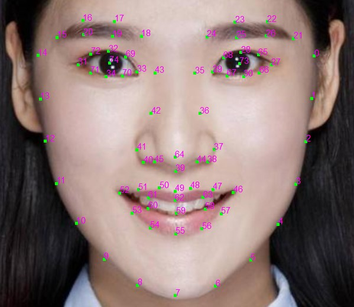
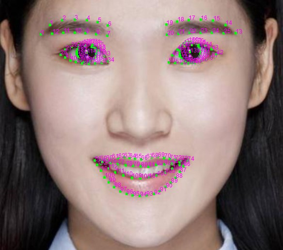

# FUAI C API 参考文档
<!--每次更新文档，更新时间-->

级别：Public   
更新日期：2020-07-15   
SDK版本: 7.1.0

------
### 最新更新内容：


------
### 目录：
<!--这个小节为目录，不用改动，为了目录好看，每个函数仅以函数名为标题无子标题，其他标题加粗显示即可-->

本文档内容目录：

[TOC]

------
### 1. 简介 
<!--简介-->

本文是相芯底层算法库的接口文档，FI_EXPORT的相关接口可以直接用于 iOS/Android NDK/Windows/Linux/Mac 上的底层开发。

------
### 2. 结构体以及常量定义
##### FI_Status 枚举
该枚举是SDK所有函数的返回状态

```C
typedef enum FI_Status {
  FI_STATUS_OK = 0,					// 表示接口正常返回
  FI_STATUS_INVALID_ARGUMENT = 1,	// 表示接口输入参数有误
  FI_STATUS_AUTH_FAILED = 2,		// 表示鉴权失败，请确认FI_Setup正常调用，否则需要检查鉴权证书的有效性
  FI_STATUS_UNKNOWN_ERROR = -1		// 未定义错误
} FI_Status;
```

##### FI_ImageFormat 枚举
该枚举是SDK支持的所有图像类型

```C
typedef enum FI_ImageFormat {
  FI_IMAGE_UNKNOWN = 0,		// 未知格式，不能作为图像格式传入
  FI_IMAGE_RGB = 1,			// RGB格式，每个像素3个字节[r,g,b]
  FI_IMAGE_BGR = 2,			// BGR格式，每个像素3个字节[b,g,r]
  FI_IMAGE_RGBA = 3,		// RGBA格式，每个像素4个字节[r,g,b,a]
  FI_IMAGE_BGRA = 4,		// BGRA格式，每个像素4个字节[b,g,r,a]
  FI_IMAGE_ARGB = 5,		// ARGB格式，每个像素4个字节[a,r,g,b]
  FI_IMAGE_ABGR = 6,		// ABGR格式，每个像素4个字节[a,b,g,r]
  FI_IMAGE_GRAY = 7,		// 灰度图格式，每个像素1个字节[gray]
  FI_IMAGE_YUV_NV12 = 8,	// NV12格式，首先所有像素的Y通道值依次排列，然后按2倍下采样[U,V]通道顺序间隔排列
  FI_IMAGE_YUV_NV21 = 9,	// NV12格式，首先所有像素的Y通道值依次排列，然后按2倍下采样[V,U]通道顺序间隔排列
  FI_IMAGE_YUV_I420 = 10,	// I420格式，首先所有像素的Y通道依次排列，然后U通道按2倍下采样依次排列，最后V通道按2倍下采样依次排列
} FI_ImageFormat;
```

##### FI_ImageRotation 枚举
该枚举是SDK支持的所有图像朝向信息。为了提升AI算法的精度和速度，SDK只识别一个朝向的图像；而在移动平台，相机通常可以4个朝向旋转（此时可以通过重力感应想硬件得到旋转信息）；所以SDK允许设置当前传入的图像的朝向

```C
typedef enum FI_ImageRotation {
  FI_IMAGE_ROTATION_0 = 0,		// 图像旋转0度
  FI_IMAGE_ROTATION_90 = 1,		// 图像旋转90度
  FI_IMAGE_ROTATION_180 = 2,	// 图像旋转180度
  FI_IMAGE_ROTATION_270 = 3,	// 图像旋转270度
} FI_ImageRotation;
```

##### FI_FaceDetectMode枚举
该枚举是SDK支持的两种人脸检测模式：视频模式下，为了优化功耗，会采取跳帧等策略降低计算量，不能保证每帧都检测到人脸；图片模式下，保证每帧都可以检测到人脸。

```C
typedef enum FI_FaceDetectMode {
  FI_FACE_DETECT_MODE_IMAGE = 0, // 图片模式，每帧都做人脸检测处理
  FI_FACE_DETECT_MODE_VIDEO = 1  // 视频模式（默认），不保证当帧检出人脸
} FI_FaceDetectMode;
```

##### FI_ImageView 结构
用来表达SDK输入图像信息的结构；为了提升性能，该结构体不会进行额外的数据拷贝，内部只会读取相应指针进行操作；所以该结构体的生效期间，相应的内存数据不允许更改。

```C
typedef struct FI_ImageView FI_ImageView;
```

##### FI_FaceProcessor 结构

用来处理人脸相关AI算法的结构
```C
typedef struct FI_FaceProcessor FI_FaceProcessor;
```

------
### 3. APIs
<!--本小节描述APIs，每个函数结束候插入分割线-->
#### 3.1 全局状态函数
##### FI_Setup 函数
初始化系统环境，加载系统数据，并进行网络鉴权。必须在调用SDK其他接口前执行，否则其他接口无法成功调用。

```C
FI_EXPORT extern FI_Status FI_Setup(const char* authpack, int size);
```

__参数:__

*authpack [in]*： 内存指针，指向鉴权数据的内容。如果是用包含 authpack.h 的方法在编译时提供鉴权数据，则这里可以写为 ```g_auth_package``` 。

*size [in]*：鉴权数据的长度，以字节为单位。如果鉴权数据提供的是 authpack.h 中的 ```g_auth_package```，这里可写作 ```sizeof(g_auth_package)```

__返回值:__

FI_Status

__备注:__

该接口首先会检测鉴权有效性，如果无效，直接返回FI_STATUS_AUTH_FAILED；然后会连接相芯科技SDK，进行网络鉴权验证，该验证异步进行，不会阻塞函数返回；如果异步鉴权验证失败，则后续功能函数调用会返回FI_STATUS_AUTH_FAILED。
该函数需要和FI_Destroy()函数配对调用

------
##### FI_Destroy 函数
结束SDK所有功能，并注销所有资源

```C
FI_EXPORT extern FI_Status FI_Destroy();
```

__返回值:__

FI_Status

__备注:__

该函数需要和FI_Setup()函数配对调用

------
##### FI_VLogSetLevel 函数
设置内部debug log级别，方便排查可能出现的异常行为

```C
FI_EXPORT extern FI_Status FI_VLogSetLevel(int level);
```

__参数:__

*level [in]*： 范围0~4，默认为0；越大log信息越多。

__返回值:__

FI_Status

------
##### FI_Version 函数
获取当前SDK详细版本信息

```C
FI_EXPORT extern FI_Status FI_Version(const char** version);
```

__参数:__

*version [out]*： 内部版本号字符串对象的指针。

__返回值:__

FI_Status


------
#### 3.2 ImageView函数

##### FI_NewImageView 函数
创建ImageView对象

```C
FI_EXPORT extern FI_Status FI_NewImageView(FI_ImageView** image_view);
```

__参数:__

*image_view [out]*： ImageView对象的指针。

__返回值:__

FI_Status


------
##### FI_DeleteImageView 函数
销毁ImageView对象

```C
FI_EXPORT extern FI_Status FI_DeleteImageView(FI_ImageView* image_view);
```

__参数:__

*image_view [in]*： ImageView对象。

__返回值:__

FI_Status


------
##### FI_ImageViewInit 函数
初始化ImageView对象

```C
FI_EXPORT extern FI_Status FI_ImageViewInit(
    FI_ImageView* image_view, FI_ImageFormat format, int width, int height,
    FI_ImageRotation rotation, const uint8_t* data0, int stride0,
    const uint8_t* data1, int stride1, const uint8_t* data2, int stride2);
```

__参数:__

*image_view [in,out]*： ImageView对象。

*format [in]*： 图像格式，FI_ImageFormat的一种。

*width [in]*： 图像宽度。

*height [in]*： 图像高度。

*rotation [in]*： 图像朝向，FI_ImageRotation的一种。

*data0 [in]*： 图像内存指针0。

*stride0 [in]*： 图像每行字节数0；注意图像的字节数未必等于其宽度，有可能会有额外的padding。

*data1 [in]*： 图像内存指针1。

*stride1 [in]*： 图像每行字节数1。

*data2 [in]*： 图像内存指针2。

*stride2 [in]*： 图像每行字节数2。

__返回值:__

FI_Status

__备注:__
这个函数提供了data0,stride0,data1,stride1,data2,stride2；目的是为了在不进行图像的额外拷贝的情况下，尽可能通用的表达各种图像格式。

对于RGB/RGBA/gray相关图像格式，通常是一段连续内存，所以只需提供data0,stride0即可；

对于NV21/NV12图像格式，通常是两段连续内存，Y通道一段，UV通道一段；所以需要提供Y通道的信息data0,stride0，和UV通道的信息data1,stride1；

对于I420图像格式，通常是三段连续内存，Y通道一段，U通道一段，V通道一段；所以需要提供Y通道信息data0,strid0, U通道信息data1,strid1, 和V通道信息data2,stride2。


------
##### FI_ImageViewSetData 函数
设置ImageView对象的某些通道的内存数据

```C
FI_EXPORT extern FI_Status FI_ImageViewSetData(FI_ImageView* image_view,
                                               int index, const uint8_t* data);
```

__参数:__

*image_view [in,out]*： ImageView对象。

*index [in]*： 通道index，范围0~2。

*data [in]*： 通道内存指针。

__返回值:__

FI_Status

__备注:__
这个函数可以用来更新某些通道的内存数据，而不用每次都重新调用整个Init函数


------
#### 3.3 人脸AI函数

##### FI_NewFaceProcessorFromBundle函数
创建人脸AI对象

```C
FI_EXPORT extern FI_Status FI_NewFaceProcessorFromBundle(
    const char* data, int size, FI_FaceProcessor** model);
```

__参数:__

*data [in]*： 人脸AI模型数据。

*size [in]*： 人脸AI模型数据的字节数。

*model [out]*： 人脸AI对象的指针。

__返回值:__

FI_Status

__备注:__

这个函数用来创建人脸AI对象，是所有人脸AI算法的前置要求；人脸AI模型数据有两种：

ai_face_processor.bundle  支持全部的人脸AI功能

ai_face_processor_lite.bundle 一个精简版本的AI模型(可以有效减少模型大小)，只支持部分AI算法，包括人脸基础特征点，人脸密集特征点，人脸DDE算法

------
##### FI_DeleteFaceProcessor
销毁人脸AI对象

```C
FI_EXPORT extern FI_Status FI_DeleteFaceProcessor(FI_FaceProcessor* model);
```

__参数:__

*model [in]*： 人脸AI对象。

__返回值:__

FI_Status

__备注:__

这个函数用来销毁人脸AI对象，需要和FI_NewFaceProcessorFromBundle()配对调用


------
##### FI_FaceProcessorProcess
人脸AI算法处理函数，该函数是人脸AI相关算法的主要计算函数；该函数可以在视频流中每帧调用，会自动处理好帧间连续一致性问题。

如果需要单独处理不连续的多张图片，用户需要调用FI_FaceProcessorReset()来清除上一帧的人脸信息。

```C
FI_EXPORT extern FI_Status FI_FaceProcessorProcess(
    FI_FaceProcessor* model, const FI_ImageView* image_view);
```

__参数:__

*model [in,out]*： 人脸AI对象。

*image_view [in]*： 图像数据对象。

__返回值:__

FI_Status


------
##### FI_FaceProcessorSetDetectMode
设置人脸检测模式

```C
FI_EXPORT extern FI_Status FI_FaceProcessorSetDetectMode(
    FI_FaceProcessor* model, FI_FaceDetectMode detect_mode);
```

__参数:__

*model [in,out]*： 人脸AI对象。

__返回值:__

FI_Status


------
##### FI_FaceProcessorReset
重置人脸AI算法，丢掉当前已经积累的人脸信息，重新开始人脸检测。

```C
FI_EXPORT extern FI_Status FI_FaceProcessorReset(FI_FaceProcessor* model);
```

__参数:__

*model [in,out]*： 人脸AI对象。

__返回值:__

FI_Status


------
##### FI_FaceProcessorSetMaxFaces
设置允许识别的最大人脸个数

```C
FI_EXPORT extern FI_Status FI_FaceProcessorSetMaxFaces(
    FI_FaceProcessor* model, int max_faces);
```

__参数:__

*model [in,out]*： 人脸AI对象。

*max_faces [in]*： 最大人脸个数，默认值为1。

__返回值:__

FI_Status


------
##### FI_FaceProcessorResetModules
重置人脸算法的各个功能模块，调用后所有人脸算法均会停止；然后可以调用FI_FaceProcessorSetUse*()相关函数来选择想要的人脸算法

```C
FI_EXPORT extern FI_Status FI_FaceProcessorResetModules(
    FI_FaceProcessor* model);
```

__参数:__

*model [in,out]*： 人脸AI对象。

__返回值:__

FI_Status


------
##### FI_FaceProcessorSetUseFaceLandmark
设置是否启用人脸基础特征点算法

```C
FI_EXPORT extern FI_Status FI_FaceProcessorSetUseFaceLandmark(
    FI_FaceProcessor* model, int use_face_landmark);
```

__参数:__

*model [in,out]*： 人脸AI对象。

*use_face_landmark [in]*： 是否启用人脸基础特征点算法，默认为1。

__返回值:__

FI_Status

__备注:__

人脸基础特征点的定义如下图所示：

  


------
##### FI_FaceProcessorSetUseDenseLandmark
设置是否启用人脸密集特征点算法

```C
FI_EXPORT extern FI_Status FI_FaceProcessorSetUseDenseLandmark(
    FI_FaceProcessor* model, int use_dense_landmark);
```

__参数:__

*model [in,out]*： 人脸AI对象。

*use_dense_landmark [in]*： 是否启用人脸密集特征点算法，默认为0。

__返回值:__

FI_Status


__备注:__

人脸密集特征点的定义如下图所示，包括眉毛、眼睛、瞳孔、嘴巴部位的高精度点位

  


------
##### FI_FaceProcessorSetUseFaceDde
设置是否启用人脸DDE算法，该算法会输出人脸的3D旋转，平移，以及一些低精度的基本的表情系数

```C
FI_EXPORT extern FI_Status FI_FaceProcessorSetUseFaceDde(
    FI_FaceProcessor* model, int use_face_dde);
```

__参数:__

*model [in,out]*： 人脸AI对象。

*use_face_dde [in]*： 是否启用人脸DDE算法，默认为1。

__返回值:__

FI_Status


------
##### FI_FaceProcessorSetUseFaceCapture
设置是否启用人脸3D Capture算法，该算法会输出人脸的3D旋转，平移，以及高精度的表情系数

```C
FI_EXPORT extern FI_Status FI_FaceProcessorSetUseFaceCapture(
    FI_FaceProcessor* model, int use_face_capture);
```

__参数:__

*model [in,out]*： 人脸AI对象。

*use_face_capture [in]*： 是否启用人脸3D Capture算法，默认为0。

__返回值:__

FI_Status


------
##### FI_FaceProcessorSetFaceCaptureUseTongueExpression
设置是否启用人脸3D Capture模式下的舌头系数算法，打开3D Capture算法后，该算法输出舌头相关系数。

```C
FI_EXPORT extern FI_Status FI_FaceProcessorSetFaceCaptureUseTongueExpression(
    FI_FaceProcessor* model, int face_capture_use_tongue);
```

__参数:__

*model [in,out]*： 人脸AI对象。

*face_capture_use_tongue [in]*： 是否启用人脸3D Capture模式下的舌头系数算法，默认为0。

__返回值:__

FI_Status


------
##### FI_FaceProcessorSetMinFaceRatio
设置人脸检测算法允许检测到的最小人脸屏占比，人脸检测耗时会随着屏占比的减小而增加

```C
FI_EXPORT extern FI_Status FI_FaceProcessorSetMinFaceRatio(
    FI_FaceProcessor* model, float min_face_ratio);
```

__参数:__

*model [in,out]*： 人脸AI对象。

*min_face_ratio [in]*： 最小人脸比例，默认值为0.2(20%屏占比)，允许的范围是[0.01,1]

__返回值:__

FI_Status


------
##### FI_FaceProcessorGetFov
获取人脸3D相关算法的FOV（field-of-view)角度，这个是透视投影相机的一个常用参数，与焦距相关；是一个float数值。

```C
FI_EXPORT extern FI_Status FI_FaceProcessorGetFov(
    const FI_FaceProcessor* model, float* result);
```

__参数:__

*model [in]*： 人脸AI对象。

*result [out]*： FOV角度指针

__返回值:__

FI_Status


------
##### FI_FaceProcessorSetFov
设置人脸3D相关算法的FOV（field-of-view)角度，这个是透视投影相机的一个常用参数，与焦距相关

```C
FI_EXPORT extern FI_Status FI_FaceProcessorSetFov(FI_FaceProcessor* model,
                                                  float fov_degree);
```

__参数:__

*model [in,out]*： 人脸AI对象。

*fov_degree [in]*： FOV角度，范围[0°~90°]，建议范围[10°~60°]

__返回值:__

FI_Status


------
##### FI_FaceProcessorGetNumResults
获取当前检测到的人脸个数，是一个int数值

```C
FI_EXPORT extern FI_Status FI_FaceProcessorGetNumResults(
    const FI_FaceProcessor* model, int* result);
```

__参数:__

*model [in]*： 人脸AI对象。

*result [out]*： 人脸个数指针

__返回值:__

FI_Status


------
##### FI_FaceProcessorGetResultRect
获取当前检测到的某个人脸的包围盒信息，是四个float数值

```C
FI_EXPORT extern FI_Status FI_FaceProcessorGetResultRect(
    const FI_FaceProcessor* model, int index, const float** result);
```

__参数:__

*model [in]*： 人脸AI对象。

*index [in]*： 人脸index，函数内部会检查所给index是否是有效范围

*result [out]*： 人脸包围盒信息指针，定义为[xmin, ymin, xmax, ymax]

__返回值:__

FI_Status


------
##### FI_FaceProcessorGetResultTrackId
获取当前检测到的某个人脸在视频追踪中的Track ID：检测到一张新的脸，直到这张脸消失为止，该脸的TrackID保持不变。TrackID是一个int数值。

```C
FI_EXPORT extern FI_Status FI_FaceProcessorGetResultTrackId(
    const FI_FaceProcessor* model, int index, int* result);
```

__参数:__

*model [in]*： 人脸AI对象。

*index [in]*： 人脸index，函数内部会检查所给index是否是有效范围

*result [out]*： Track ID指针

__返回值:__

FI_Status


------
##### FI_FaceProcessorGetResultConfidenceScore
获取当前检测到的某个人脸的置信度，是一个float数值

```C
FI_EXPORT extern FI_Status FI_FaceProcessorGetResultConfidenceScore(
    const FI_FaceProcessor* model, int index, float* result);
```

__参数:__

*model [in]*： 人脸AI对象。

*index [in]*： 人脸index，函数内部会检查所给index是否是有效范围

*result [out]*： 置信度指针

__返回值:__

FI_Status


------
##### FI_FaceProcessorGetResultLandmarks
获取当前检测到的某个人脸的基础特征点信息，是float数组

```C
FI_EXPORT extern FI_Status FI_FaceProcessorGetResultLandmarks(
    const FI_FaceProcessor* model, int index, const float** result,
    int* result_size);
```

__参数:__

*model [in]*： 人脸AI对象。

*index [in]*： 人脸index，函数内部会检查所给index是否是有效范围

*result [out]*： 人脸特征点数组指针

*result_size [out]*： 人脸特征点个数指针，是一个int，表示result结果的float个数

__返回值:__

FI_Status


------
##### FI_FaceProcessorGetResultAllLandmarks
获取当前检测到的某个人脸的所有特征点信息+额外特征点(+密集特征点，以及后续可能补充的其他特征点)，是float数组

```C
FI_EXPORT extern FI_Status FI_FaceProcessorGetResultAllLandmarks(
    const FI_FaceProcessor* model, int index, const float** result,
    int* result_size);
```

__参数:__

*model [in]*： 人脸AI对象。

*index [in]*： 人脸index，函数内部会检查所给index是否是有效范围

*result [out]*： 人脸特征点数组指针

*result_size [out]*： 人脸特征点个数指针，是一个int，表示result结果的float个数

__返回值:__

FI_Status


------
##### FI_FaceProcessorGetResultExpression
获取当前检测到的某个人脸的表情系数，是float数组；

```C
FI_EXPORT extern FI_Status FI_FaceProcessorGetResultExpression(
    const FI_FaceProcessor* model, int index, const float** result,
    int* result_size);
```

__参数:__

*model [in]*： 人脸AI对象。

*index [in]*： 人脸index，函数内部会检查所给index是否是有效范围

*result [out]*： 人脸表情系数数组指针

*result_size [out]*： 人脸表情系数个数指针，是一个int，表示result结果的float个数

__返回值:__

FI_Status

__备注:__
人脸表情系数blendshape定义参考[文件夹expressions](./expressions)里的图示。


------
##### FI_FaceProcessorGetResultTongueExpression
获取当前检测到的某个人脸舌头的表情系数，是float数组

```C
FI_EXPORT extern FI_Status FI_FaceProcessorGetResultTongueExpression(
    const FI_FaceProcessor* model, int index, const float** result,
    int* result_size);
```

__参数:__

*model [in]*： 人脸AI对象。

*index [in]*： 人脸index，函数内部会检查所给index是否是有效范围

*result [out]*： 舌头表情系数数组指针

*result_size [out]*： 人脸表情系数个数指针，是一个int，表示result结果的float个数

__返回值:__

FI_Status

__备注:__
舌头表情系数blendshape定义参考[舌头表情系数.pdf](./expressions/舌头_blendshape.pdf)


------
##### FI_FaceProcessorGetResultRotation
获取当前检测到的某个人脸的3D旋转信息，是float数组

```C
FI_EXPORT extern FI_Status FI_FaceProcessorGetResultRotation(
    const FI_FaceProcessor* model, int index, const float** result,
    int* result_size);
```

__参数:__

*model [in]*： 人脸AI对象。

*index [in]*： 人脸index，函数内部会检查所给index是否是有效范围

*result [out]*： 人脸3D旋转数组指针，是一个四元数[x,y,z,w]

*result_size [out]*： 人脸3D旋转个数指针，是一个int，表示result结果的float个数，返回值应该为4

__返回值:__

FI_Status


------
##### FI_FaceProcessorGetResultTranslation
获取当前检测到的某个人脸的3D位置信息，是float数组

```C
FI_EXPORT extern FI_Status FI_FaceProcessorGetResultTranslation(
    const FI_FaceProcessor* model, int index, const float** result,
    int* result_size);
```

__参数:__

*model [in]*： 人脸AI对象。

*index [in]*： 人脸index，函数内部会检查所给index是否是有效范围

*result [out]*： 人脸3D位置数组指针，是一个三维坐标[x,y,z]

*result_size [out]*： 人脸3D位置个数指针，是一个int，表示result结果的float个数，返回值应该为3

__返回值:__

FI_Status


------
##### FI_FaceProcessorGetResultEyesRotation
获取当前检测到的某个人脸的眼球3D旋转信息，是float数组

```C
FI_EXPORT extern FI_Status FI_FaceProcessorGetResultEyesRotation(
    const FI_FaceProcessor* model, int index, const float** result,
    int* result_size);
```

__参数:__

*model [in]*： 人脸AI对象。

*index [in]*： 人脸index，函数内部会检查所给index是否是有效范围

*result [out]*： 人脸眼球3D旋转数组指针，是一个四元数[x,y,z,w]

*result_size [out]*： 人脸眼球3D旋转个数指针，是一个int，表示result结果的float个数，返回值应该为4

__返回值:__

FI_Status


------

### 4. 常见问题 

#### 算法SDK的线程安全性
算法SDK通过多实例来保证线程安全性：

1. 每个AI模型实例需要在同一个线程调用；
2. 多线程下可以创建多个AI模型实例。

#### 算法SDK的使用方法

可以参考代码样例：[fuai_interface_sample](./sample/fuai_interface_sample.cc)