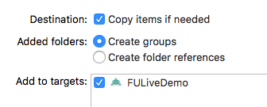

# Mac Nama SDK 集成指导文档  
级别：Public   
更新日期：2020-12-29   
SDK版本: 7.3.0  

------

### 最新更新内容：

**2020-9-29 v7.3.0:  **

- 优化美妆性能，和V7.2比，标准美妆Android端帧率提升29%，iOS端帧率提升17%；标准美颜+标准美妆，集成入第三方推流1小时后，在低端机上帧率高于15fps，可流畅运行。
- 优化美体性能，和V7.2比，性能显著提升，Android端帧率提升26%，CPU降低32%；iOS端帧率提升11%，CPU降低46%，内存降低45%。
- 优化背景分割性能，和V7.2比，性能显著提升，Android端帧率提升64%，CPU降低25%；iOS端帧率提升41%，CPU降低47%，内存降低44%。请使用ai_human_processor_mb_fast.bundle。
- 优化美体功能效果，优化大幅度运动时，头部和肩部位置附近物体变形幅度大的问题；人体在画面中出现消失时过渡更自然；遮挡情况美体效果更加稳定，不会有高频持续抖动情况。
- 优化表情识别功能，提高识别准确性，共能识别17种表情动作，对应新增FUAITYPE_FACEPROCESSOR_EXPRESSION_RECOGNIZER。
- 优化绿幕抠像效果，提高边缘准确度。
- 优化人脸表情跟踪驱动效果，优化首帧检测模型显示较慢问题，加强细微表情跟踪，优化人脸转动时模型明显变小问题。
- 优化全身Avatar跟踪驱动效果，针对做连续高频大幅度运动的情况，如跳舞等场景，整体模型稳定性，尤其手臂稳定性提升，抖动情况显著改善。
- 优化美颜亮眼下眼睑溢色问题。
- 新增人脸拖拽变形功能，可使用FUCreator 2.1.0进行变形效果编辑。
- 新增美颜美型模块瘦圆眼功能，效果为使眼睛整体放大，尤其是纵向放大明显。
- 新增支持手势回调接口fuSetHandGestureCallBack，详见接口文档。

------
## 目录：
本文档内容目录：

[TOC]

------
## 1. 简介 
本文档旨在说明如何将Faceunity Nama SDK集成宿主APP中。  

------


## 2. SDK文件结构

本小节，描述Demo文件结构，各个目录，以及重要文件的功能。

```
+Faceunity
  -authpack.h		       	//鉴权文件
  +CNamaSDK.framework				//nama 动态库    
  +Resources
    +graphics        //渲染道具资源
    +model           //ai 资源
    
```

------
## 3. 集成指引


### 3.1 开发环境
#### 3.1.1 支持平台
```
macOS 10.6以上系统
```
#### 3.1.2 开发环境
```
Xcode 8或更高版本
```

### 3.2 导入SDK 
 #### 3.2.1 通过cocoapods集成

全功能版本：

```
pod 'Nama-macOS', '7.3.0' 
```

不含物理引擎的版本（lite版）：

```
pod 'Nama-macOS-lite', '7.3.0' 
```

接下来执行：

```
pod install
```

如果提示无法找到该版本，请尝试执行以下指令后再试：

```
pod repo update 或 pod setup
```

#### 3.2.1 通过 github 下载集成

全功能版本：[FaceUnity-SDK-Mac-v7.3.0.zip](https://www.faceunity.com/sdk/FaceUnity-SDK-Mac-v7.3.0.zip)

不含物理引擎的版本（lite版）：[FaceUnity-SDK-Mac-v7.3.0-lite.zip](https://www.faceunity.com/sdk/FaceUnity-SDK-Mac-v7.3.0-lite.zip)

下载完成并解压后将库文件夹拖入到工程中，并勾选上 Copy items if needed，如图：

------



CNamaSDK.framework是动态库，需要在General->Framworks，Libraries,and Embedded  Content 中添加依赖关系，并将Embed设置为Embed&Sign，否则会导致运行后因找不到库而崩

如图：

------


### 3.3 相关配置

#### 3.3.1 导入证书

authpack.h 证书文件，一般由我司通过邮箱发送给使用者

您需要拥有我司颁发的证书才能使用我们的SDK的功能，获取证书方法：

1、拨打电话 **0571-89774660** 

2、发送邮件至 **marketing@faceunity.com** 进行咨询。

iOS端发放的证书为包含在authpack.h中的g_auth_package数组，如果您已经获取到鉴权证书，将authpack.h导入工程中即可。根据应用需求，鉴权数据也可以在运行时提供(如网络下载)，不过要注意证书泄露风险，防止证书被滥用。

### 3.4 初始化

首先在代码中引入 FURenderer.h 头文件

```c
#import "FURenderer.h"
```

然后执行初始化

```c
[[FURenderer shareRenderer] setupWithData:nil dataSize:0 ardata:nil authPackage:&g_auth_package authSize:sizeof(g_auth_package) shouldCreateContext:YES];
```

注1：app启动后只需要setup一次FURenderer即可，其中 `g_auth_package` 密钥数组声明在 authpack.h 中。

至此，工程的配置及 SDK 的初始化工作已全部完成，下面就可以通过我们的 SDK 进行视频处理了！

注2：v6.6.0 后初始化v3参数可以为 nil 

接口说明：

```
- (int)setupWithData:(void *)data dataSize:(int)dataSize ardata:(void *)ardata authPackage:(void *)package authSize:(int)size shouldCreateContext:(BOOL)shouldCreate;
```

参数说明：

`data`  v3.bundle 文件  v6.6.0 后 传 NULL 即可

`dataSize` v3.bundle 数据的字节数

`ardata` 该参数已废弃，传 NULL 即可

`package` 内存指针，指向鉴权数据的内容。如果是用包含 authpack.h 的方法在编译时提供鉴权数据，则这
里可以写为 g_auth_package 

`size` 鉴权数据的长度，以字节为单位。如果鉴权数据提供的是 authpack.h 中的 g_auth_package ，
这里可写作 sizeof(g_auth_package)

`create` 如果设置为YES，我们会在内部创建并持有一个context，这种情况下工程中必须要使用OC层接口

#### 3.4.2 加载AI道具

#### 3.4.1 初始化SDk

例：加载人体AI模型道具ai_hunman_processor.boundle

1. 加载二级制bundle

```objective-c
    NSData *ai_human_processor = [NSData dataWithContentsOfFile:[[NSBundle mainBundle] pathForResource:@"ai_human_processor.bundle" ofType:nil]];
    
```

2. 通过 **loadAIModelFromPackage** 设置到SDK

```objective-c
[FURenderer loadAIModelFromPackage:(void *)ai_human_processor.bytes size:(int)ai_human_processor.length aitype:FUAITYPE_HUMAN_PROCESSOR];

```

### 3.5 道具创建、销毁、切换

#### 3.5.1 道具创建

创建道具接口：

```objective-c
+ (int)itemWithContentsOfFile:(NSString *)path
```

参数说明：

`path` 道具路径

返回值：

`int` 道具句柄

示例：

```objective-c
NSString *path = [[NSBundle mainBundle] pathForResource:@"tiara" ofType:@"bundle"];

int itemHandle = [FURenderer itemWithContentsOfFile:path];
```

在实际应用中有时需要同时使用多个道具，我们的图像处理接口接受的的参数是一个包含多个道具句柄的int数组，所以我们需要将创建一个int数组来保存这些道具句柄。下面我们将创建一个花环道具的句柄并保存在int数组的第0位，示例如下：

```objective-c
int items[3];

NSString *path = [[NSBundle mainBundle] pathForResource:@"tiara" ofType:@"bundle"];

int itemHandle = [FURenderer itemWithContentsOfFile:path];

items[0] = itemHandle;
```


#### 3.5.2 道具销毁

**销毁单个道具：**

```objective-c
/**
销毁单个道具
 */
+ (void)destroyItem:(int)item;
```

参数说明：

`item ` 要销毁的道具句柄

该接口将释放传入的句柄所对应的资源，为保证编程的严谨性，在执行完该操作后请将该句柄置为0。示例如下：

```objective-c
if (items[0] != 0) {
	[FURenderer destroyItem:items[0]];
}
items[0] = 0;
```

**销毁全部道具：**

```C
/**
销毁所有道具
 */
+ (void)destroyAllItems;

```

该接口可以销毁全部道具句柄所对应的资源,同样在执行完该接口后请将所有句柄都置为0。示例如下：

```C
[FURenderer destroyAllItems];
    
for (int i = 0; i < sizeof(items) / sizeof(int); i++) {
	items[i] = 0;
}
```

#### 3.5.3 道具切换

如果需要切换句柄数组中某一位的句柄时，需要先创建一个新的道具句柄，并将该句柄替换到句柄数组中需要被替换的位置上，最后再把被替换的句柄销毁掉。下面以替换句柄数组的第0位为例进行说明：

```C
    // 先创建再释放可以有效缓解切换道具卡顿问题
    NSString *path = [[NSBundle mainBundle] pathForResource:_demoBar.selectedItem ofType:@"bundle"];
    int itemHandle = [FURenderer itemWithContentsOfFile:path];
    
    if (items[0] != 0) {
        [FURenderer destroyItem:items[0]];
    }
    
    items[0] = itemHandle;
```

注意：如果这里先销毁了老的道具，再创建新的道具会可能出现道具不连续的现象，即短时间没有道具的现象。

### 3.6 视频处理

将上一步创建的包含一个贴纸道具句柄的items数组传入视频图像处理接口，同时传入需要被处理的图像，即可为图像添加特效贴纸，示例如下：

```objective-c
CVPixelBufferRef pixelBuffer = CMSampleBufferGetImageBuffer(sampleBuffer);
    
[[FURenderer shareRenderer] renderPixelBuffer:pixelBuffer withFrameId:frameID items:items itemCount:sizeof(items)/sizeof(int) flipx:YES];

frameID += 1;
```

图像处理接口说明：

```objective-c
- (CVPixelBufferRef)renderPixelBuffer:(CVPixelBufferRef)pixelBuffer
                      	  withFrameId:(int)frameid
                                items:(int*)items
						    itemCount:(int)itemCount
                                flipx:(BOOL)flip;
```

参数说明：

`pixelBuffer ` 图像数据，支持的格式为：BGRA、YUV420SP

`frameid ` 当前处理的视频帧序数，每次处理完对其进行加1操作，不加1将无法驱动道具中的特效动画

`items ` 包含多个道具句柄的int数组

`itemCount ` 句柄数组中包含的句柄个数

`flip ` 道具镜像使能，如果设置为YES可以将道具做镜像操作

返回值：

`CVPixelBufferRef ` 被处理过的的图像数据

------
## 4. 功能模块
### 4.1 视频美颜

视频美颜配置方法与视频加特效道具类似，首先创建美颜道具句柄，并保存在上面提到的items数组的items[1]中,示例如下:

```objective-c
- (void)loadFilter
{
    NSString *path = [[NSBundle mainBundle] pathForResource:@"face_beautification" ofType:@"bundle"];
    items[1] = [FURenderer itemWithContentsOfFile:path];
}
```

在处理视频时，将包含美颜道具句柄的items数组传入视频图像处理接口，同时传入需要被处理的图像，即可为图像添加美颜效果，示例如下：

```objective-c
CVPixelBufferRef pixelBuffer = CMSampleBufferGetImageBuffer(sampleBuffer);
    
[[FURenderer shareRenderer] renderPixelBuffer:pixelBuffer withFrameId:frameID items:items itemCount:sizeof(items)/sizeof(int) flipx:YES];

frameID += 1;
```

详细参数说明[FULiveDemo美颜道具功能文档](美颜道具功能文档.md)。

#### 4.1.1 滤镜

滤镜功能主要通过参数 `filter_level` 和 `filter_name` 来控制。

`filter_name` 参数的取值和相关介绍详见：[美颜道具功能文档](美颜道具功能文档.md) ，在**滤镜对应key值**部分有详细介绍，对于老版本（6.0之前）的用户，可以参考**新老滤镜对应关系**部分。

`filter_level` 取值范围 0.0-1.0，0.0为无效果，1.0为最大效果，默认值1.0。

**示例代码：**

```C
//  Set item parameters - filter
[FURenderer itemSetParam:items[1] withName:@"filter_name" value:@"origin"];
[FURenderer itemSetParam:items[1] withName:@"filter_level" value:@(1.0)];
```

#### 4.1.2 美白红润

__美白__

美白功能主要通过参数color_level来控制

```objective-c
color_level 取值范围 0.0-2.0,0.0为无效果，2.0为最大效果，默认值0.2
```

设置参数的例子代码如下：

```C
//  Set item parameters - whiten
[FURenderer itemSetParam:items[1] withName:@"color_level" value:@(0.5)];
```

__红润__

红润功能主要通过参数red_level 来控制

```objective-c
red_level 取值范围 0.0-2.0,0.0为无效果，2.0为最大效果，默认值0.5
```

设置参数的例子代码如下：

```objc
//  Set item parameters - red
[FURenderer itemSetParam:items[1] withName:@"red_level" value:@(0.5)];
```

#### 4.1.3 磨皮

控制磨皮的参数有四个：blur_level，skin_detect，nonskin_blur_scale，heavy_blur

  `blur_level`:  磨皮程度，取值范围0.0-6.0，默认6.0 
  `skin_detect`: 肤色检测开关，0为关，1为开
  `nonskin_blur_scale`: 肤色检测之后非肤色区域的融合程度，取值范围0.0-1.0，默认0.45
  `heavy_blur`:  重度磨皮开关，0为清晰磨皮，1为重度磨皮

设置参数的例子代码如下：

```objective-c
//  Set item parameters - blur
[FURenderer itemSetParam:items[1] withName:@"heavy_blur" value:@(1)];
[FURenderer itemSetParam:items[1] withName:@"skin_detect" value:@(1)];
[FURenderer itemSetParam:items[1] withName:@"blur_level" value:@(6.0)];
[FURenderer itemSetParam:items[1] withName:@"blur_blend_ratio" value:@(0.5)];
[FURenderer itemSetParam:items[1] withName:@"nonshin_blur_scale" value:@(0.45)];
```

#### 4.1.4 亮眼

亮眼功能主要通过参数eye_bright 来控制

  `eye_bright`:   取值范围 0.0-1.0,0.0为无效果，1.0为最大效果，默认值1.0

设置参数的例子代码如下：

```objc
//  Set item parameters - eye_bright
[FURenderer itemSetParam:items[1] withName:@"eye_bright" value:@(0.5)];
```

#### 4.1.5 美牙

美牙功能主要通过参数tooth_whiten来控制

  `tooth_whiten`:   取值范围 0.0-1.0,0.0为无效果，1.0为最大效果，默认值1.0

设置参数的例子代码如下：

```objc
//  Set item parameters - tooth_whiten
[FURenderer itemSetParam:items[1] withName:@"tooth_whiten" value:@(0.5)];
```

#### 4.1.6 美型
美型的整体程度由face_shape_level参数控制

  `face_shape_level`:   取值范围 0.0-1.0,  0.0为无效果，1.0为最大效果，默认值1.0

美型的渐变由change_frames参数控制

  `change_frames`:  0为关闭 ，大于0开启渐变，值为渐变所需要的帧数

美型的种类主要由face_shape 参数控制

  `face_shape`:   变形取值 0:女神变形 1:网红变形 2:自然变形 3:默认变形 4:精细变形

在face_shape选取不同参数时，对应可以使用的参数也不同：

__face_shape参数详解__

1. `face_shape` 为0 1 2 3时对应0：女神 1：网红 2：自然 3：默认 

   可以使用参数
     `eye_enlarging`:  默认0.5,  //大眼程度范围0.0-1.0

     `cheek_thinning`:  默认0.0,   //瘦脸程度范围0.0-1.0

2. `face_shape`:  为4时，为精细变形，添加了鼻子额头嘴巴下巴的调整
   可以使用参数

    `eye_enlarging`:  默认0.5,           //大眼程度范围0.0-1.0

    `cheek_thinning`:	默认0.0,  		//瘦脸程度范围0.0-1.0

    `cheek_v`:	默认0.0,  		//v脸程度范围0.0-1.0

    `cheek_narrow`:   默认0.0,          //窄脸程度范围0.0-1.0

    `cheek_small`:   默认0.0,          //小脸程度范围0.0-1.0

     `intensity_nose`:  默认0.0,           //瘦鼻程度范围0.0-1.0

     `intensity_forehead`:  默认0.5,   //额头调整程度范围0.0-1.0

     `intensity_mouth`: 默认0.5,         //嘴巴调整程度范围0.0-1.0

     `intensity_chin`:  默认0.5,          //下巴调整程度范围0.0-1.0

   设置参数的例子代码如下：

```
/* 整体程度 */
[FURenderer itemSetParam:items[1] withName:@"face_shape_level" value:@(1.0)];
/* 大眼 */
[FURenderer itemSetParam:items[1] withName:@"eye_enlarging" value:@(1.0)]
```

------

### 4.2 手势识别

目前我们的手势识别功能也是以道具的形式进行加载的。一个手势识别的道具中包含了要识别的手势、识别到该手势时触发的动效、及控制脚本。加载该道具的过程和加载普通道具、美颜道具的方法一致。

线上例子中 heart_v2.bundle 为爱心手势演示道具。将其作为道具加载进行绘制即可启用手势识别功能。手势识别道具可以和普通道具及美颜共存，类似美颜将手势道具句柄保存在items句柄数组即可。

自定义手势道具的流程和2D道具制作一致，具体打包的细节可以联系我司技术支持。

__使用方法__

加载手势道具 `itemName`，并保存到句柄数组items

```objective-c
NSString *path = [[NSBundle mainBundle] pathForResource:[itemName stringByAppendingString:@".bundle"] ofType:nil];
int itemHandle = [FURenderer itemWithContentsOfFile:path];
```

带重力感应方向的手势道具需要设置`rotMode`参数为设备重力方向，value 取值为 (0 ~ 3);

```objective-c
[FURenderer itemSetParam:itemHandle withName:@"rotMode" value:@(0)];
```

------

### 4.3 3D绘制抗锯齿功能

高效全屏抗锯齿，使得3D绘制效果更加平滑。

加载抗锯齿道具道具 ，并保存到句柄数组items

```objective-c
NSString *path = [[NSBundle mainBundle] pathForResource:@"fxaa.bundle" ofType:nil];
int itemHandle = [FURenderer itemWithContentsOfFile:path];
```

------

### 4.4 照片驱动功能

__使用方法__：

- 直接加载对应的道具
- 需要带有照片驱动权限的证书

```objective-c
NSString *path = [[NSBundle mainBundle] pathForResource:[itemName stringByAppendingString:@".bundle"] ofType:nil];
int itemHandle = [FURenderer itemWithContentsOfFile:path];
```

------

### 4.5 人脸夸张变形功能

加载夸张表情道具 `itemName`，并保存到句柄数组items

```objective-c
NSString *path = [[NSBundle mainBundle] pathForResource:[itemName stringByAppendingString:@".bundle"] ofType:nil];
int itemHandle = [FURenderer itemWithContentsOfFile:path];
```

------

### 4.6 音乐滤镜

加载音乐滤镜道具 `itemName`，并保存到句柄数组items

```objective-c
NSString *path = [[NSBundle mainBundle] pathForResource:[itemName stringByAppendingString:@".bundle"] ofType:nil];
int itemHandle = [FURenderer itemWithContentsOfFile:path];
```

通过随着音乐设置播放时间才能让滤镜“动”一起

```objective-c
 [FURenderer itemSetParam:items[1] withName:@"music_time" value:@([FUMusicPlayer sharePlayer].currentTime * 1000 + 50)];//需要加50ms的延迟
```

------

### 4.7 动漫滤镜+Animoji的AR模式

#### 4.7.1 Animoji

加载Animoji道具 `itemName`，并保存到句柄数组items

```objective-c
NSString *path = [[NSBundle mainBundle] pathForResource:[itemName stringByAppendingString:@".bundle"] ofType:nil];
int itemHandle = [FURenderer itemWithContentsOfFile:path];
```

Animoji默认渲染时不会跟踪人脸位置，但是可以通过开启AR模式来开启跟踪和背景图像显示：

```objective-c
[FURenderer itemSetParam:itemHandle withName:@"{\"thing\":\"<global>\",\"param\":\"follow\"}" value:@(1)];
```

镜像相关参数`value`为（0或1）：

```objective-c
[FURenderer itemSetParam:itemHandle withName:@"is3DFlipH" value:@(1)];
[FURenderer itemSetParam:itemHandle withName:@"isFlipExpr" value:@(1)];
[FURenderer itemSetParam:itemHandle withName:@"isFlipTrack" value:@(1)];
[FURenderer itemSetParam:itemHandle withName:@"isFlipLight" value:@(1)];
```

#### 4.7.2 动漫滤镜

加载动漫滤镜道具 `itemName`，并保存到句柄数组items

```objective-c
NSString *path = [[NSBundle mainBundle] pathForResource:[itemName stringByAppendingString:@".bundle"] ofType:nil];
int itemHandle = [FURenderer itemWithContentsOfFile:path];
```

### 4.8 舌头驱动

加载舌头驱动道具 `tongue.bundle`,

```objective-c
NSData *tongueData = [NSData dataWithContentsOfFile:[[NSBundle mainBundle] pathForResource:@"tongue.bundle" ofType:nil]];
int ret0 = fuLoadTongueModel((void *)tongueData.bytes, (int)tongueData.length) ;
```

### 4.9 美发功能

[美发参数说明](美发道具功能文档.md)

加载美发道具 `itemName`，并保存到句柄数组items

```objective-c
NSString *path = [[NSBundle mainBundle] pathForResource:[itemName stringByAppendingString:@".bundle"] ofType:nil];
int itemHandle = [FURenderer itemWithContentsOfFile:path];
```

发色种类设置，`colorIndex` (0~n）

```objective-c
[FURenderer itemSetParam:items[1] withName:@"Index" value:@(colorIndex)]; 
```

发色程度值,`Strength` 值为(0 ~ 1.0)

```objective-c
 [FURenderer itemSetParam:items[1] withName:@"Strength" value: @(strength)]; 
```

### 4.10 美妆功能

Nama SDK 从 6.0.0 开始支持美妆功能。

使用细节请参考[美妆道具参数说明](美妆道具功能文档.md)，同时参考 FULiveDemoMac 中的示例代码。

------

### 5. 常见问题  

#### 5.1 道具切换不连续的现象？

 如果需要切换句柄数组中某一位的句柄时，需要先创建一个新的道具句柄，并将该句柄替换到句柄数组中需要被替换的位置上，最后再把被替换的句柄销毁掉

#### 5.2 道具镜像？

__普通2D道具镜像__

视频处理接口，参数`flip`道具镜像使能，如果设置为YES可以将道具做镜像操作

__高级镜像__

```objective-c
//is3DFlipH 参数是用于对3D道具的顶点镜像
[FURenderer itemSetParam:itemHandle withName:@"is3DFlipH" value:@(1)];
//isFlipExpr 参数是用于对道具内部的表情系数的镜像
[FURenderer itemSetParam:itemHandle withName:@"isFlipExpr" value:@(1)];
//isFlipTrack 参数是用于对道具的人脸跟踪位置旋转的镜像
[FURenderer itemSetParam:itemHandle withName:@"isFlipTrack" value:@(1)];
//isFlipLight 参数是用于对道具内部的灯光的镜像
[FURenderer itemSetParam:itemHandle withName:@"isFlipLight" value:@(1)];
```


