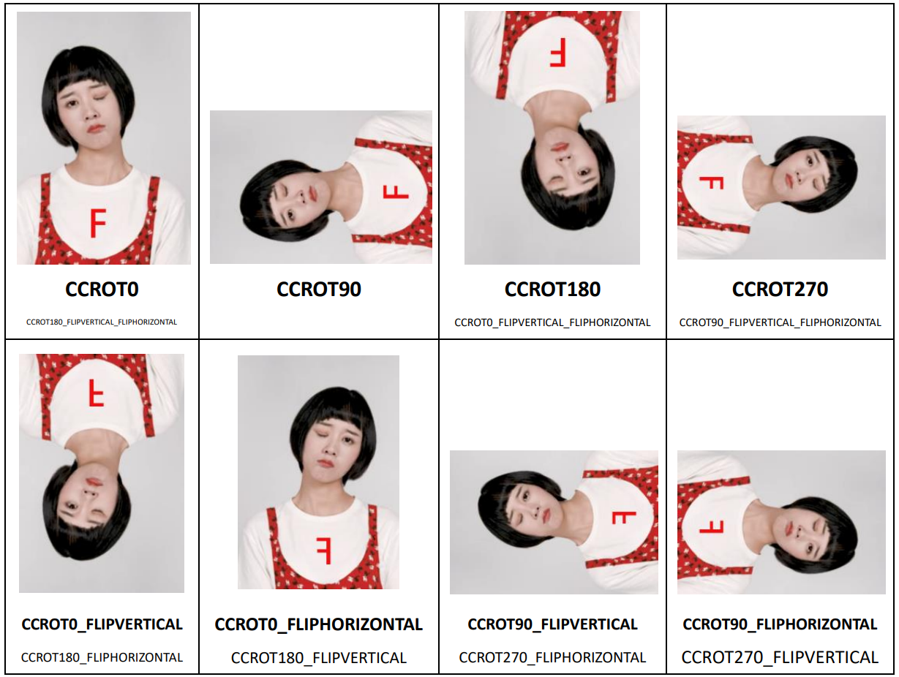

# Nama C API Reference

------
### Updates：

2021-01-25 v7.4.0:

1. Optimize 2D human body points and body beautification performance.
2. Optimize the effect and performance of human image segmentation. Optimize the unstable recognition of arms and hands and the misrecognition of background. Solve the problem of human image segmentation deviation.
3. Optimize the effect of makeup.Improve the fit of cosmetic lenses and solve the problem of color overflow. Optimize the cover effect of lipsticks. To be more specific, lipstick will no longer appear when the lip is covered.
4. Optimize the driving effect of Animoji on face. Optimize small movements. For example, the driving effect is more sensitive when opening mouth and blinking eyes in a small range.
5. Optimize emotion recognition and support 8 kinds of basic emotion recognition.
6. Added new API: fuSetUseAsyncAIInference. Support asynchronous mode. When it is turned on, the frame rate will be increased, which can improve insufficient frame rate on some low-end devices.
7. Added new interface: fuRender.Unified rendering interface for all services. See the API definition for more details.
8. Added API such as fuSetInputBufferMatrix，fuSetInputCameraBufferMatrixState，fuSetInputTextureMatrix，fuSetInputCameraTextureMatrixState，fuSetOutputMatrix，fuSetOutputMatrixState. They are used to set the image conversion matrix and adjust the output image direction. See the API definition for more details.


2021-01-25 v7.3.2:

1. Optimize the driving performance of facial expression tracking.

2. Change fuSetup function to thread safety.

3. fuSetUp 、fuCreateItemFromPackage、fuLoadAIModel function increase exception handling, and strengthen robustness.

4. Fix the the effect of the custom mirror's function.

5. Fix the crash problem of SDK on MAC 10.11.

6. Fix the crash problem of SDK when stickers and Animoji are in mixed use.  
   

2020-12-29 v7.3.0:

1. Optimize beauty performance. Compared with v7.2, the frame rate of standard beauty is increased by 29% and 17% in Android and IOS respectively.
2. Optimize the performance of body beautification. Compared with v7.2, the performance is improved significantly. The frame rate of Android is increased by 26%, and the CPU is reduced by 32%; the frame rate of IOS increased by 11%, CPU reduced by 46%, and memory reduced by 45%.
3. Optimize background segmentation performance. Compared with v7.2, the performance is significantly improved.The frame rate  of Android is increased by 64%, and the CPU is reduced by 25%; The frame rate of IOS is increased by 41%, CPU is reduced by 47%, and memory is reduced by 44%.
4. Optimize the effect of body beautification. When large amplitude motion occures, the problem of great deformation of objects near the head and shoulder is solved. When the human body appears and disappears in the picture, the transition is more natural.Body beautification effect of occlusion is more stable and no high frequency and continuous shaking left.
5. Optimize the expression recognition function. Improve the accuracy of recognition. A total of 17 kinds of expression can be recognized.
6. Optimize the green screen matting effect and improve the edge accuracy.
7. Optimize the driving effect of facial expression tracking, optimize the slow display of the first frame detection model, strengthen the subtle expression tracking, and optimize the problem that the model becomes smaller when the face rotates.
8. Optimize the whole body Avatar tracking driving effect. For continuous high-frequency and large amplitude motion, such as dancing, the overall model stability, especially the arm stability, is improved, and the shaking problem is significantly improved.
9. Optimize the problem of eyelid color overflow when eye brightness is used.
10. Added face drag deformation function. You can use FUCreator 2.1.0 to edit deformation effect.
11. Added thin round eyes in the beauty module. The effect is to make the whole eye enlarged, and the longitudinal amplification is extensively obvious.
12.Added support gesture to callback API fuSetHandGestureCallBack. See API document for details.
13. Added AI capability，expression recognition，AITYPE is FUAITYPE_FACEPROCESSOR_EXPRESSION_RECOGNIZER.

2020-9-24 v7.2.0:
1. Added green screen matting function, which supports to replace pictures, video background, etc. See green screen matting function documentation for details.
2. Added thin cheekbones and thin mandible in the beauty module.
3. Optimize beauty performance and power consumption. Solved the problem of frame dropping when integrating into the third-party streaming service.
4. Optimize the effect and performance of gesture recognition, improve the recognition stability and gesture following effect, optimize the CPU occupancy of gesture recognition.
5. Optimize the the performance of each function in PC, and the frame rate is significantly improved. The frame rate of hair beautification, body beautification and background segmentation is increased by more than 30%, and the frame rate of beauty, Animoji, makeup, gesture and other functions is also increased by more than 10%.
6. Optimization package is increased. SDK is divided into Lite version and full function version. The lite version is smaller and contains face related functions (except for face changing posters).
7. Optimize the stability of face tracking and stickers.
8. Independent core algorithm SDK is provided. See algorithm SDK document for API document.([FUAI_C_API_Reference.md](./FUAI_C_API_Reference.md))。
9. Added three parameters in fuGetFaceInfo API，including tongue direction(tongue_direction)，expression recognition(expression_type)，and head rotation information Euler angle parameter(rotation_euler)。
10. Added fuOnDeviceLostSafe function. See API document for details.
11. Added fuSetFaceProcessorDetectMode function. Face recognition tracking is devided into graphic mode and video mode. See API document for details.
12. Added human motion recognition movement definition documentation([Human_Motion_Recognition_Documentation.md](../resource/docs/Human_Motion_Recognition_Documentation.md))。
13. Added ai_hand_processor.bundle，replace ai_gesture.bundle，and provide gesture recognition tracking capability.

2020-7-29 v7.1.0:

1. Added face beautification sharpening function. See face beautification parameter documentation.
2. Optimize the skin grinding effect, and preserve more high-frequency details.
3. Added fuHumanProcessorGetFov API.
4. Added fuHumanProcessorSetFov API.

2020-7-24 v7.0.1:
1. Added new interface: fuHumanProcessorSetBonemap
2. Added new interface: fuHumanProcessorGetResultTransformArray
3. Added new interface: fuHumanProcessorGetResultModelMatrix
4. Fixed fuGetSestemError problem
5. Fixed the failed set of fuSetMaxFaces after releasing AI model.
6. Fixed the OES input problem in Android non-Qualcomm devices.
7. Fixed the black frame problem of the mouth with the long distance of makeup.
8. Fixed the problem that body beautification and beautification can not coexist.


2020-6-30 v7.0.0:
1. Added new human algorithm capability interfaces, including human detection, 2D Human key points (whole / half body), 3D human skeleton (whole / half body), gesture recognition, portrait mask, hair mask, head mask, motion recognition, etc.
2. Newly added interfaces. See interface description for details.
  - fuGetLogLevel, get the current log level.
  - fuSetLogLevel, set the current log level.
  - fuOpenFileLog, open the file log and use console log by default.
  - fuFaceProcessorSetMinFaceRatio，Set the interface of face detection distance.
  - fuSetTrackFaceAIType，set the run type interface of fuTrackFace algorithm.
  - fuSetCropState，set clipping status
  - fuSetCropFreePixel，set free clip parameter.
  - fuSetFaceProcessorFov，set FaceProcessor face algorithm module tracking fov.
  - fuGetFaceProcessorFov，get FaceProcessor face algorithm module tracking fov.
  - fuHumanProcessorReset，reset the status of HumanProcessor face algorithm module
  - fuHumanProcessorSetMaxHumans，set the tracking number of HumanProcessor human body algorithm module.
  - fuHumanProcessorGetNumResults，get the tracking number of HumanProcessor human body algorithm module.
  - fuHumanProcessorGetResultTrackId，get the tracking ID of HumanProcessor human body algorithm module.
  - fuHumanProcessorGetResultRect，get the tracking frame of HumanProcessor human body algorithm module. 
  - fuHumanProcessorGetResultJoint2ds，get the 2D key poins of HumanProcessor human body algorithm module.
  - fuHumanProcessorGetResultJoint3ds，get the 3D key poins of HumanProcessor human body algorithm module.
  - fuHumanProcessorSetBonemap，set HumanProcessor human algorithm module and 3D bone topology information.
  - fuHumanProcessorGetResultTransformArray，get HumanProcessor human algorithm module and 3D bone topology information.
  - fuHumanProcessorGetResultModelMatrix， get HumanProcessor human algorithm module and 3D bone topology information and root node model change matrix
  - fuHumanProcessorGetResultHumanMask，get the whole body mask of HumanProcessor human algorithm module.
  - fuHumanProcessorGetResultActionType，get the tracted action type of HumanProcessor human algorithm module.
  - fuHumanProcessorGetResultActionScore，get the action confidence of HumanProcessor human algorithm module. 
  - fuFaceProcessorGetResultHairMask，get the hair mask of HumanProcessor human algorithm module. 
  - fuFaceProcessorGetResultHeadMask，get the head mask of HumanProcessor human algorithm module. 
  - fuHandDetectorGetResultNumHands，get the gesture-tracking number of HandGesture algorithm module.
  - fuHandDetectorGetResultHandRect，get the gesture-tracking frame of HandGesture algorithm module.
  - fuHandDetectorGetResultGestureType，get the gesture-tracking type of HandGesture algorithm module.
  - fuHandDetectorGetResultHandScore，get the gesture-tracking confidence of HandGesture algorithm module.
3. Abandoned interfaces
  - fuSetStrictTracking
  - fuSetASYNCTrackFace
  - fuSetFaceTrackParam  
  - fuSetDeviceOrientation  
  - fuSetDefaultOrientation


2020-3-19 v6.7.0:
1. Optimize the flexibility of expression coefficient in V6.6.0, and animoji expression tracking is more flexible.  
2. Added new interface: fuIsLibraryInit to check if the SDK is initialized.
3. In the AI capability model, face related capabilities are combined into one. Integrate FUAITYPE::FUAITYPE_FACELANDMARKS75,FUAITYPE_FACELANDMARKS209,FUAITYPE_FACELANDMARKS239,FUAITYPE_FACEPROCESSOR into FUAITYPE_FACEPROCESSOR。Parameter "landmarks_type" in beautification is closed and automatically switched by the system.
4. Optimize beautification module：  
	- Added dark circles removing and law pattern removing  
	- Optimize the effect of beautification
	- Optimize the effect of beautification and ruddy. The new function supports only grinding face area.
5. The newly added interface supports image clipping, which can be used for the deformation cutting of the thin face edge. See fuSetCropState，fuSetCropFreePixel interfaces for details.
6. Optimize the beautification effect and the face point, and improve the accuracy.
	- Optimize the position and effect of lipstick, and solve the lipstick overflow in the situation of mouth opening, face straightening, low head raising, left and right head turning and mouth pursing.
	- Optimize the effect of pupil point, the effect of pupil is more accurate.
	- Optimize the effect of blusher. Solved the problem of blush under the upward angle.

2020-01-19 v6.6.0:
Notes: When updates SDK 6.6.0，after fuSetup，it is needed to call fuLoadAIModelFromPackage immidiately to load ai_faceprocessor.bundle into FUAITYPE::FUAITYPE_FACEPROCESSOR!!!

In Nama 6.6.0 or above，AI ability will be called according to the needs of props to avoid multiple calls in the same frame; At the same time, Nama AI subsystem manages the reasoning and simplifies the calling process; Split the capabilities and product functions to avoid redundant AI model resources in the props bundle, facilitate maintenance and upgrade, and speed up the loading of props; Facilitate the integration of new and old AI capabilities and subsequent upgrade iterations.

Basic logic：After Nama's initialization, one or more AI capability modules that may be used in the future can be loaded in advance. When calling the real-time render processing interface, Nama main pipe will analyze the AI capabilities required by all props at the beginning, and then the AI subsystem will perform relevant capability reasoning, and then start to call the "life cycle" function of each props. Each props only need to call JS interface in a specific "life cycle" function to obtain the AI reasoning results, And it is used for related logic processing or rendering.

1. Added new interface fuLoadAIModelFromPackage to load AI capability model.
2. Added new interface fuReleaseAIModel to release AI capability model.
3. Added new interface fuIsAIModelLoaded to judge whether AI capability is loaded.
4. Added fuSetMultiSamples interface，MSAA Anti aliasing interface，to solve edge sawtooth of virtual image and other content.

Example 1：Background segmentation
	a. Load AI capability model. Load fuLoadAIModelFromPackage加载ai_bgseg.bundle into FUAITYPE::FUAITYPE_BACKGROUNDSEGMENTATION.
	b. Load product business prop A, which uses the background segmentation ability.
	c. Switch product business prop B. Prop B also uses the background segmentation ability, but the AI ability does not need to be reloaded.

2019-09-25 v6.4.0:

1. v6.4.0 changes no interface

2019-08-14 v6.3.0:

1. Added fuSetFaceTrackParam function to set face tracking parameters

2019-06-27 v6.2.0:

1. fuSetFaceDetParam function added new parameter: enable_large_pose_detection.

2019-05-27 v6.1.0:

1. Added fuSetupLocal function, supporting offline authentication.
2. Added fuDestroyLibData function，supporting tracker memory release.

2019-03-31 v6.0.0：
1. Added fuSetFaceDetParam function to set face tracking parameters.
2. Added fuTrackFaceWithTongue function，supporting tongue tracking.
3. Added fuSetTongueTracking，trun on / off tongue tracking.
4. Added parameter expression_with_tongue in fuGetFaceInfo to get tongue information.
5. Abandon fuLoadExtendedARData。

------
### Contents：


[TOC]

------
### 1. Introduction 

This document is the infrastructure layer interface for FaceUnity face tracking and video effects development kit (Nama SDK for short). The Nama API in this document is the Native interface for direct development on PC/iOS/Android NDK/Linux. Development on the iOS and Android platforms can use the SDK's application-level interface (Objective-C/Java), which is closer to the platform-related development experience than the infrastructure layer interface in this article.

All SDK-related calls require sequential execution in the same thread, without support for multithreading. A small number of interfaces can be called asynchronously (such as props loading) and will be specifically noted in the remarks. Interfaces called by all main threads of the SDK need to keep the OpenGL context consistent, otherwise it will cause texture data exceptions. If you need to use the SDK's rendering function, all calls to the main thread need to pre-initialize the OpenGL environment, without initialization or incorrect initialization will cause a crash. Our environment requirement for OpenGL is GLES 2.0 or higher. For the specific call method, please refer to each platform demo.*

The infrastructure layer interface is classified into five categories according to the role of logic: initialization, propsloading, main running interface, destruction, functional interface, P2A related interface.

------
### 2. APIs
#### 2.1 Initialization
##### fuSetup
Initialize the system environment, load system data, and perform network authentication. Must be executed before calling other interfaces of the SDK, otherwise it will cause a crash.

```C
int fuSetup(float* v3data, int sz_v3data, float* ardata, void* authdata, int sz_authdata);
```

__Parameters：__

*v3data [in]*： Abandoned. Pass nullptr. Memory pointer to the v3.bundle file provided by SDK.

*sz_v3data [in]*: Abandoned. Pass in 0。v3.bundle file Bytes

*ardata [in]*： Abandoned.

*authdata [in]*： Memory pointer, pointing to the content of authentication data. If the authpack.h method is used to provide authentication data at compile time, it can be written as ```g_auth_package``` .

*sz_authdata [in]*：The length of authentication data, in bytes. If the authentication data provides ```g_auth_package```in authpack.h，it can be written as ```sizeof(g_auth_package)```

__Return Value：__

Returns a non-zero value for success and 0 for failure. If initialization fails, get the error code via ```fuGetSystemError```.

__Notes: __

According to the application requirements, authentication data can also be provided at runtime (such as network download), but we should pay attention to the risk of certificate leakage to prevent certificate abuse.
The data length adopts ```int```to prevent cross platform data type problems.

It needs to be initialized where GL context exists.

------
##### fuSetupLocal
Initialize the system environment, load system data, and perform network authentication. Must be executed before calling other interfaces of the SDK, otherwise it will cause a crash.

```C
int fuSetupLocal(float* v3data, int sz_v3data,float* ardata,void* authdata,int sz_authdata,void** offline_bundle_ptr,int* offline_bundle_sz);

```

__Parameters：__

*v3data [in]*： Abandoned. Pass nullptr. Memory pointer to the v3.bundle file provided by SDK.

*sz_v3data [in]*: Abandoned. Pass in 0。v3.bundle file Bytes

*ardata [in]*： Abandoned.

*authdata [in]*：  Memory pointer, pointing to the content of authentication data. If the authpack.h method is used to provide authentication data at compile time, it can be written as ```g_auth_package``` .

*sz_authdata [in]*：The length of authentication data, in bytes. If the authentication data provides ```g_auth_package```in authpack.h，it can be written as ```sizeof(g_auth_package)```

*offline_bundle_ptr [in/out]*： Memory pointer, pointing to the content of the offline certificate. The pointer of offline certificate bundle buffer.

*offline_bundle_sz [in/out]*：Length of offline certificate data in bytes.

__Return Value：__

Returns a non-zero value for success and 0 for failure. If initialization fails, get the error code via ```fuGetSystemError```.

If successful, parameter `offline_bundle_ptr`and`offline_bundle_sz` will be modified to the content of the real offline certificate. It needs to be saved, such as. Bundle file. If it is used in the next initialization of authentication, network authentication is not required.

__Notes:__  

According to the application requirements, authentication data can also be provided at runtime (such as network download), but we should pay attention to the risk of certificate leakage to prevent certificate abuse.

The data length adopts ```int```to prevent cross platform data type problems.

It needs to be initialized in GL context.

For the first time, you need to authenticate online. After the authentication is successful, save the new certificate. Do not connect to the Internet later. 

##### FUAITYPE
Algorithm capability type, it can be used in fuSetTrackFaceAItype and other interfaces.
```c
typedef enum FUAITYPE{
	FUAITYPE_BACKGROUNDSEGMENTATION=1<<1,//Background segmentation, useable in V7.0.0 or above. FUAITYPE_HUMAN_PROCESSOR_SEGMENTATION
	FUAITYPE_HAIRSEGMENTATION=1<<2,		//Hair segmentation，useable in V7.0.0 or above. FUAITYPE_FACEPROCESSOR_HAIRSEGMENTATION
	FUAITYPE_HANDGESTURE=1<<3,			//Gesture recognition
	FUAITYPE_TONGUETRACKING=1<<4,		//Not used yet
	FUAITYPE_FACELANDMARKS75=1<<5,		//Abandoned
	FUAITYPE_FACELANDMARKS209=1<<6,		//Abandoned
	FUAITYPE_FACELANDMARKS239=1<<7,		//Advanced facial feature points. The actual points after V7.0.0 is 241.
	FUAITYPE_HUMANPOSE2D=1<<8,			//2D body points，useable in V7.0.0 or above. FUAITYPE_HUMAN_PROCESSOR_2D_DANCE
	FUAITYPE_BACKGROUNDSEGMENTATION_GREEN=1<<9,//Green screen segmentation
	FUAITYPE_FACEPROCESSOR=1<<10，				//Face algorithm module, with low quality and high performance expression tracking by default.
	FUAITYPE_FACEPROCESSOR_FACECAPTURE = 1 << 11,	//high quality expression tracking
  	FUAITYPE_FACEPROCESSOR_FACECAPTURE_TONGUETRACKING = 1 << 12,	//Extra tongue tracking in high quality expression tracking mode
  	FUAITYPE_FACEPROCESSOR_HAIRSEGMENTATION = 1 << 13,	//Hair segmentation in face algorithm mode
  	FUAITYPE_FACEPROCESSOR_HEADSEGMENTATION = 1 << 14,	//Head segmentation in face algorithm mode
  	FUAITYPE_FACEPROCESSOR_EXPRESSION_RECOGNIZER = 1 << 15, //expression recognition
  	FUAITYPE_HUMAN_PROCESSOR = 1 << 16,			//Human body algorithm module
  	FUAITYPE_HUMAN_PROCESSOR_DETECT = 1 << 17,	//In the human body algorithm mode, the whole human body detection is carried out in every frame, and the performance is relatively poor
  	FUAITYPE_HUMAN_PROCESSOR_2D_SELFIE = 1 << 18,//2D half body point positioning in human body algorithm mode
  	FUAITYPE_HUMAN_PROCESSOR_2D_DANCE = 1 << 19,//2D whole body point positioning in human body algorithm mode
  	FUAITYPE_HUMAN_PROCESSOR_2D_SLIM = 1 << 20,//Body algorithm mode for 2D whole body points, optimize the whole body key point detection mode for the body scene, with faster performance
  	FUAITYPE_HUMAN_PROCESSOR_3D_SELFIE = 1 << 21,//3D half body point positioning in human body algorithm mode
  	FUAITYPE_HUMAN_PROCESSOR_3D_DANCE = 1 << 22,//3D whole body point positioning in human body algorithm mode
  	FUAITYPE_HUMAN_PROCESSOR_SEGMENTATION = 1 << 23 //Human segmentation in human algorithm mode
}FUAITYPE;
```

##### fuLoadAIModelFromPackage
Newly added API in SDK6.6.0. After fuSetup，It can pre-load the AI capabilities that may need to be used in the future. AI model and SDK are launched together in Assets content.

```C
/**
\brief Load AI model data, to support tongue animation.
\param data - the pointer to AI model data 'ai_xxx.bundle', 
	which is along beside lib files in SDK package
\param sz - the data size, we use plain int to avoid cross-language compilation issues
\param type - define in FUAITYPE enumeration.
\return zero for failure, one for success.
*/
FUNAMA_API int fuLoadAIModelFromPackage(void* data,int sz,FUAITYPE type);
```

__Parameters：__

*data [in]*： Memory pointer，direct to ai****.bundle provided by SDK，which is AI capability model.

*sz [in]*: data file bytes

*type [in]*：Describe the AI capability types corresponding to bundles. See FUAITYPE for details：


__Return Value：__

0 stands for failure, and 1 for success.

Model can be released via fuReleaseAIModel. fuIsAIModelLoaded can check whether Ai capability model is loaded.

__Notes:__  

AI capability will launch with SDK，saved in assets/model.
- ai_bgseg.bundle is the AI ability model of background segmentation, corresponding to FUAITYPE_BACKGROUNDSEGMENTATION. After V7.0.0, the whole body mask module corresponding to ai_human_processor.bundle can be used uniformly.
- ai_hairseg.bundle is hair segmentation AI capability model, corresponding to FUAITYPE_HAIRSEGMENTATION。After V7.0.0，the whole body mask module corresponding to ai_face_processor.bundle can be used uniformly.
- ai_hand_processor.bundle ( ai_gesture.bundle will be abandoned after V7.2.0 ） is gesture recognition AI capability model, corresponding to FUAITYPE_HANDGESTURE. 
- ai_facelandmarks75.bundle is a 75 point AI capability model for facial feature points.	//Abandoned
- ai_facelandmarks209.bundle is a 209 point AI capability model for facial feature points.	//Abandoned
- ai_facelandmarks239.bundle is a 239 point AI capability model for facial feature points.	//Abandoned
- ai_humanpose.bundle is the human 2D point AI capability model, corresponding to FUAITYPE_HUMANPOSE2D。After V7.0.0，the human body points module corresponding toai_human_processor.bundle can be used uniformly.
- ai_bgseg_green.bundle is green screen background segmentation AI capability model, corresponding to FUAITYPE_BACKGROUNDSEGMENTATION_GREEN.
- ai_face_processor.bundle is facial feature points, expression tracking, hair mask, head mask, expression recognition and other AI capability models. It needs to be loaded by default, corresponding to FUAITYPE_FACEPROCESSOR.
- ai_human_processor.bundle  is a human algorithm capability model, including human detection, 2D Human key points (whole body, half body), 3D human skeleton (whole body, half body), human image mask, action recognition and other capabilities，corresponding to FUAITYPE_HUMAN_PROCESSOR.__Notes:__ ai_human_processor_mb_fast.bundle is a high performance version of mobile phone background segmentation.

##### fuReleaseAIModel
When there is no need to use specific AI capabilities, it can release its resources and save memory space. 1 means released, 0 means not released.

```C
/**
\brief Release AI Model, when no more need some type of AI albility.
\param type - define in FUAITYPE enumeration.
\return zero for failure, one for success.
*/
FUNAMA_API int fuReleaseAIModel(FUAITYPE type);
```

__Parameters：__

*type [in]*：Describe the AI capability types corresponding to bundles. See FUAITYPE for details：


__Return Value：__

1 means released and 0 means not released.

__Notes:__  

The memory consumption of AI capability model is not high, so it is recommended to stay in memory for a long time.

------
##### fuIsAIModelLoaded
Get to know whether the AI capability has been loaded. 1 means loaded and 0 means not loaded.

```C
/**
\brief Get AI Model load status
\param type - define in FUAITYPE enumeration.
\return zero for unloaded, one for loaded.
*/
FUNAMA_API int fuIsAIModelLoaded(FUAITYPE type);
```

__Parameters：__

*type [in]*：Describe the AI capability types corresponding to bundles. See FUAITYPE for details：

__Return Value：__

0 stands for not loaded yet, and 1 for loaded.

__Notes:__  

The memory consumption of AI capability model is not high, so it is recommended to stay in memory for a long time.

------
##### fuGetLogLevel
Get the current log level.

```C
/**
 \brief Get current log level
 \return ref to FULOGLEVEL
*/
FUNAMA_API FULOGLEVEL fuGetLogLevel();
```

__Return Value：__

FULOGLEVEL
```C
typedef enum FULOGLEVEL {
  FU_LOG_LEVEL_TRACE = 0, //Debug log, multiple times per frame
  FU_LOG_LEVEL_DEBUG = 1, //Debug log, one or more messages per frame
  FU_LOG_LEVEL_INFO = 2,  //Normal information log, information appearing once in the process of program running, system information, etc
  FU_LOG_LEVEL_WARN = 3,  //Warning log
  FU_LOG_LEVEL_ERROR = 4, //Error log
  FU_LOG_LEVEL_CRITICAL = 5, //Error log and log that affect the normal operation of the program
  FU_LOG_LEVEL_OFF = 6 //Turn off log output
} FULOGLEVEL;
```

__Notes:__  

------
##### fuSetLogLevel
Set the current log level and the default is INFO level. Set when FU_LOG_LEVEL_OFF, close all logs. Set only when the log greater than or equal to the current level, the log can be output normally.

```C
/**
 \brief Set log level
 \param level - define in FULOGLEVEL enumeration.
 \return zero for failed, one for success.
*/
FUNAMA_API int fuSetLogLevel(FULOGLEVEL level);
```
__Parameters：__

*level [in]*：Set the current log level. See FULOGLEVEL definition for details.

__Return Value：__

1 stands for success，and 0 for failure.

__Notes:__  

------
##### fuOpenFileLog

Open file log, nullptr use console log by default.

```C
/**
 \brief open file log
 \param file_fullname - nullptr for default terminal, non-null for log into
 file. \param max_file_size, max file size in byte. \param max_files, max file
 num for rotating log. \return zero for failed, one for success.
*/
FUNAMA_API int fuOpenFileLog(const char* file_pullname, int max_file_size,
                             int max_files);
```
__Parameters：__

*file_pullname [in]*：Log file name, full path, log file location are determined by external. nullptr represents using console log by default.
*max_file_size [in]*：Log file maximum size, exceeding will be reset.
*max_files [in]*：Rotate the number of log files and rotate among multiple log files.

__Return Value：__

1 stands for success，and 0 for failure.

__Notes:__  

------

#### 2.2 Prop package loading

##### fuCreateItemFromPackage

Load the prop package so that it can be executed in the main run interface. A prop package may be a function module or a collection of multiple function modules. The prop loading package may activate the corresponding function module and implement plug and play in the same SDK calling logic.

``` C
int fuCreateItemFromPackage(void* data, int sz);
```

__Parameters：__  

*data [in]*： Memory pointer, pointing to the contents of the loaded props package. Props usually end with  \*.bundle.

*sz [in]*：The data length of the prop package content, in bytes.

__Return Value：__

An integer handle, as the identifier of the prop in the system.

__Notes:__  

The interface can be executed asynchronously with rendering. In order to avoid loading props to block the rendering thread, it is recommended to call asynchronously.

------
##### fuItemSetParam

Modify or set the value of the variable in the prop package. support the prop package variable name, meaning, and range of values.

```C
// Set double type variables in props
int fuItemSetParamd(int item,char* name,double value);
// Set double array type variables in props
int fuItemSetParamdv(int item,char* name,double* value,int n);
// Set string type variables in props
int fuItemSetParams(int item,char* name,char* value);
```

__Parameters：__

*item [in]*： Prop indicator，the content should be the return value after calling ```fuCreateItemFromPackage``` function, and the content of the props has not been destroyed.

*name [in]*：String pointer, the content of which is the name of the prop variable to be set.

*value [in]*：The variable value waiting to be set，the data type corresponds to different function interfaces.

*n [in]*：When the variable is set as a double array, the length of the array data is in double.

__Return Value：__

Return 0 means failure, greater than 0 means success.

__Notes:__

When setting the variable to a string, the string is required to end with '\0'. Asynchronous call is supported for all of the above interfaces.

------
##### fuItemGetParamd
Get the value of the variable in the prop item. Support the prop package variable name, meaning, and range of values.

```C
// Get floating point type variable in props
double fuItemGetParamd(int item,char* name);
```
__Parameters：__

*item [in]*： Prop indicator，the content should be the return value after calling ```fuCreateItemFromPackage``` function, and the content of the props has not been destroyed.

*name [in]*：String pointer, the content of which is the name of the prop variable to be set.

__Return Value：__

The variable value that needs to be get. Return 0 means failure.

__Notes：__  

The interface can be executed asynchronously with the main thread.

------
##### fuItemGetParams
Get the string type variable in the prop.

```C
// Get the string type variable in the prop.
int fuItemGetParams(int item,char* name,char* buf,int sz);
```

__Parameters：__  

*item [in]*： Prop indicator，the content should be the return value after calling ```fuCreateItemFromPackage``` function, and the content of the props has not been destroyed.

*name [in]*：String pointer, the content of which is the name of the prop variable to be set.

*buf [out]*：Memory pointer, pointing to the pre allocated memory space, used to receive the string content returned by the function.

*sz [in]*：The maximum length of memory pre allocated in * buf *, in bytes.

__Return Value：__  

Return the length of the variable string. Return -1 means failure.  

__Notes：__  

This interface can be executed asynchronously with the main thread. 


#### 2.3 Main running interface
------
##### fuRender
The general rendering interface sends the input image data to the SDK pipeline for processing, and outputs the processed image data.

```C
fuRender(int out_format, void* out_ptr, int in_format,void* in_ptr, int w, int h, int frame_id, int* p_items,int n_items, int func_flag, void* p_item_masks);
```

__Parameters：__  

*out_format [in]*：The output data format identifier.

*out_ptr [out]*：Memory pointer, pointing to the output data content.

*in_format [in]*：The entered data format identifier. 

*in_ptr [in]*：Memory pointer, pointing to the input data content.

*w [in]*：The width of the input image

*h [in]*：The height of the input image

*frame_id [in]*：The current processed frame sequence number，used to control the animation logic in props.

*p_items [in]*：Memory pointer, pointing to the property identifier array to be executed. Each identifier should be the return value of calling the function ```fuCreateItemFromPackage``` , and the prop content has not been destroyed.

*n_items [in]*：The number of props in the *p_items* array.

*func_flag*：Pipeline function mask, which indicates the function modules enabled by pipeline and specific drawing options. Multiple masks are connected by the operator "or". All supported masks and their meanings are as follows.

| Pipeline function mask     | meaning     |
| ---- | ---- |
| NAMA_RENDER_FEATURE_TRACK_FACE     | Face recognition and tracking function     |
| NAMA_RENDER_FEATURE_BEAUTIFY_IMAGE     | Input image beautification function    |
| NAMA_RENDER_FEATURE_RENDER     | Face related rendering functions, such as beauty, stickers, face deformation, filters, etc     |
| NAMA_RENDER_FEATURE_ADDITIONAL_DETECTOR     | Other non-face recognition functions include background segmentation, gesture recognition and so on     |
| NAMA_RENDER_FEATURE_RENDER_ITEM     | Face related props drawing, such as stickers     |
| NAMA_RENDER_FEATURE_FULL     | Full on of assembly line functions     |
| NAMA_RENDER_OPTION_FLIP_X     | Drawing options, flip horizontal     |
| NAMA_RENDER_OPTION_FLIP_Y     | Drawing options, flip vertically     |

*p_item_masks*：The mask of props indicates which faces each props works on in multiplayer mode. The length of the array should be equal to *p_items* are consistent, and each item has an int type mask. In the mask, from the low bit to the high bit of int, a value of 1 in the i-th bit means that the prop will take effect on the i-th face, and a value of 0 means that it will not take effect.


__Return Value：__  

The texture ID of the output image after processing. Return value less than 0 is abnormal. See `fuGetSystemError` for details.

__Notes:__  

Even in non texture mode, the function returns the texture ID of the output image. Although the input and output in this mode are memory arrays, the rendering is still done through GPU, so the texture ID of the output image also exists. The output OpenGL texture is created in the current OpenGL context by SDK runtime, and its ID should be different from the input ID. When using the texture after output, you need to ensure that the OpenGL context is consistent.

**The drawing interface needs OpenGL environment, otherwise, it will lead to a crash.**  

When using this interface，you can use `fuSetInputCameraTextureMatrix`、`fuSetInputCameraBufferMatrix` to rotate and mirror the original image`fuSetInputCameraTextureMatrix`、`fuSetInputCameraBufferMatrix`. See the interface document for details.  


------
##### fuRenderItems
Send the inputed image data to SDK pipeline for processing, and output the processed image data. The interface will perform all the function modules required by props and license, including face detection and tracking, beauty, sticker or avatar rendering.

The interface supports two input and output modes, input RGBA texture and output RGBA texture, or input bgra array and output bgra array. The RGBA texture is OpenGL texture. In this mode, the ID of the input texture is passed in, and the output texture ID is returned in the function return value. Bgra array is memory image cache, and the data format is 8-bit 4-channel image. In this mode, the input image is passed in through parameters, and the output image will be covered in the same memory space.

```C
int fuRenderItems(int texid,int* img,int w,int h,int frame_id, int* p_items,int n_items);
```

__Parameters：__  

*texid [in]*：OpenGL texture ID input in texture mode, 0 in non texture mode.

*img [in & out]*：The input image data in memory array mode, the processed image data is also covered in the memory space. In texture mode, the parameter can be NULL.

*w [in]*：The width of the input image

*h [in]*：The height of the input image

*frame_id [in]*：The current processed frame sequence number，used to control the animation logic in props.

*p_items [in]*：Memory pointer, pointing to the property identifier array to be executed. Each identifier should be the return value of calling the function ```fuCreateItemFromPackage``` , and the prop content has not been destroyed.

*n_items [in]*：The number of props in the *p_items* array.


__Return Value：__  

The texture ID of the output image after processing. Return value less than 0 is abnormal. See `fuGetSystemError` for details.

__Notes:__  

Even in non texture mode, the function returns the texture ID of the output image. Although the input and output in this mode are memory arrays, the rendering is still done through GPU, so the texture ID of the output image also exists. The output OpenGL texture is created in the current OpenGL context by SDK runtime, and its ID should be different from the input ID. When using the texture after output, you need to ensure that the OpenGL context is consistent.

**The drawing interface needs OpenGL environment, otherwise, it will lead to a crash.**  

------
##### fuRenderItemsEx
Send the inputed image data to SDK pipeline for processing, and output the processed image data. The interface will perform all the function modules required by props and license, including face detection and tracking, beauty, sticker or avatar rendering.

Compared with ```fuRenderItems```, this interface supports more flexible input and output modes, and the detailed input and output format list will be included in the following chapters [Input And Output Format List](#Input_And_Output_Format_List).

```C
int fuRenderItemsEx(
	int out_format,void* out_ptr,
	int in_format,void* in_ptr,
	int w,int h,int frame_id, int* p_items,int n_items);
```

__Parameters：__  

*out_format [in]*：The output data format identifier.

*out_ptr [out]*：Memory pointer, pointing to the output data content.

*in_format [in]*：The entered data format identifier. 

*in_ptr [in]*：Memory pointer, pointing to the input data content.

*w [in]*：The width of the input image.

*h [in]*：The height of the input image.

*frame_id [in]*：The current processed frame sequence number，used to control the animation logic in props.

*p_items [in]*：Memory pointer, pointing to the property identifier array to be executed. Each identifier should be the return value of calling the function ```fuCreateItemFromPackage``` , and the prop content has not been destroyed.

*n_items [in]*：The number of props in the *p_items* array.

__Return Value：__  

The texture ID of output image after processing.

__Notes:__  

Even in non texture mode, the function returns the texture ID of the output image. Although the input and output in this mode are memory arrays, the rendering is still done through GPU, so the texture ID of the output image also exists. The output OpenGL texture is created in the current OpenGL context by SDK runtime, and its ID should be different from the input ID. When using the texture after output, you need to ensure that the OpenGL context is consistent.

**The drawing interface needs OpenGL environment, otherwise, it will lead to a crash.**  

------
##### fuRenderItemsEx2
Send the inputed image data to SDK pipeline for processing, and output the processed image data.

Compared with ```fuRenderItemsEx```, this interface increases the user's control of the flow line. By passing in the pipeline function mask parameter, you can control the switch of the specified function module and specific drawing options. By passing in the mask array of props, you can control which faces each props will take effect on in the case of multiple faces.

```C
int fuRenderItemsEx2(
	int out_format,void* out_ptr,
	int in_format,void* in_ptr,
	int w,int h,int frame_id, int* p_items,int n_items,
	int func_flag, int* p_item_masks);
```

__Parameters：__  

*out_format [in]*：The output data format identifier.

*out_ptr [out]*：Memory pointer, pointing to the output data content.

*in_format [in]*：The entered data format identifier. 

*in_ptr [in]*：Memory pointer, pointing to the input data content.

*w [in]*：The width of the input image.

*h [in]*：The height of the input image.

*frame_id [in]*：The current processed frame sequence number，used to control the animation logic in props.

*p_items [in]*：Memory pointer, pointing to the property identifier array to be executed. Each identifier should be the return value of calling the function ```fuCreateItemFromPackage``` , and the prop content has not been destroyed.

*n_items [in]*：The number of props in the *p_items* array.

*func_flag*：Pipeline function mask, which indicates the function modules enabled by pipeline and specific drawing options. Multiple masks are connected by the operator "or". All supported masks and their meanings are as follows.

| Pipeline function mask     | Meaning     |
| ---- | ---- |
| NAMA_RENDER_FEATURE_TRACK_FACE     | Face recognition and tracking function     |
| NAMA_RENDER_FEATURE_BEAUTIFY_IMAGE     | Input image beautification function     |
| NAMA_RENDER_FEATURE_RENDER     | Face related rendering functions, such as beauty, stickers, face deformation, filters, etc     |
| NAMA_RENDER_FEATURE_ADDITIONAL_DETECTOR     | Other non-face recognition functions include background segmentation, gesture recognition and so on     |
| NAMA_RENDER_FEATURE_RENDER_ITEM     | Face related props drawing, such as stickers     |
| NAMA_RENDER_FEATURE_FULL     | Full on of assembly line functions     |
| NAMA_RENDER_OPTION_FLIP_X     | Drawing options, flip horizontal     |
| NAMA_RENDER_OPTION_FLIP_Y     | Drawing options, flip vertically     |

*p_item_masks*：The mask of props indicates which faces each props works on in multiplayer mode. The length of the array should be equal to *p_items*  are consistent, and each item has an int type mask. In the mask, from the low bit to the high bit of int, a value of 1 in the i-th bit means that the prop will take effect on the i-th face, and a value of 0 means that it will not take effect.


__Return Value：__  

The texture ID of the output image after processing.

__Notes:__  

Even in non texture mode, the function returns the texture ID of the output image. Although the input and output in this mode are memory arrays, the rendering is still done through GPU, so the texture ID of the output image also exists. The output OpenGL texture is created in the current OpenGL context by SDK runtime, and its ID should be different from the input ID. When using the texture after output, you need to ensure that the OpenGL context is consistent.

**The drawing interface needs OpenGL environment, otherwise, it will lead to a crash.**  

------
##### fuBeautifyImage
Send the inputed image data to SDK pipeline for processing, and output the processed image data. This interface only performs beautification processing (including filter and skin), does not perform face tracking and all face related operations (such as beauty type). This interface, due to its centralized functions, requires less computation and is more efficient compared with the ```fuRenderItemsEx```  interface.


```C
int fuBeautifyImage(
	int out_format,void* out_ptr,
	int in_format,void* in_ptr,
	int w,int h,int frame_id, int* p_items,int n_items);
```

__Parameters：__  

*out_format [in]*：The output data format identifier.

*out_ptr [out]*：Memory pointer, pointing to the output data content.

*in_format [in]*：The entered data format identifier. 

*in_ptr [in]*：Memory pointer, pointing to the input data content.

*w [in]*：The width of the input image.

*h [in]*：The height of the input image.

*frame_id [in]*：The current processed frame sequence number，used to control the animation logic in props.

*p_items [in]*：Memory pointer, pointing to the property identifier array to be executed. Each identifier should be the return value of calling the function ```fuCreateItemFromPackage``` , and the prop content has not been destroyed.

*n_items [in]*：The number of props in the *p_items* array.

__Return Value：__  

The texture ID of the output image after processing.

__Notes:__  

If the interface works normally, the props that need to be passed in must contain beauty props (distributed with SDK, usually with the file name of ```face_beautification.bundle```）. All non-beauty props in the passed in props will not take effect and will not take up computing resources.


**The drawing interface needs OpenGL environment, otherwise, it will lead to a crash.**  

------
##### fuRenderBundles
Send the inputed image data to SDK pipeline for processing, and output the processed image data. The interface will implement theController、FXAA、CartoonFilter and other props requirements, and certificate licensing function modules, including face detection and tracking, body tracking, avatar rendering, FXAA anti aliasing, cartoon filter post-processing, etc.

```C
int fuRenderBundles(
	int out_format,void* out_ptr,
	int in_format,void* in_ptr,
	int w,int h,int frame_id, int* p_items,int n_items);
```

__Parameters：__  

*out_format [in]*：The output data format identifier.

*out_ptr [out]*：Memory pointer, pointing to the output data content.

*in_format [in]*：The entered data format identifier. 

*in_ptr [in]*：Memory pointer, pointing to the input data content.

*w [in]*：The width of the input image.

*h [in]*：The height of the input image.

*frame_id [in]*：The current processed frame sequence number，used to control the animation logic in props.

*p_items [in]*：Memory pointer, pointing to the property identifier array to be executed. Each identifier should be the return value of calling the function ```fuCreateItemFromPackage``` , and the prop content has not been destroyed.

*n_items [in]*：The number of props in the *p_items* array.

__Return Value：__  

The texture ID of the output image after processing.

__Notes:__  

Even in non texture mode, the function returns the texture ID of the output image. Although the input and output in this mode are memory arrays, the rendering is still done through GPU, so the texture ID of the output image also exists. The output OpenGL texture is created in the current OpenGL context by SDK runtime, and its ID should be different from the input ID. When using the texture after output, you need to ensure that the OpenGL context is consistent.

**The drawing interface needs OpenGL environment, otherwise, it will lead to a crash.**  

------
##### fuRenderBundlesEx
Send the inputed image data to SDK pipeline for processing, and output the processed image data. The interface will perform all the function modules required by props and license, including face detection and tracking, beauty, sticker or avatar rendering.

Compared with ```fuRenderBundles```, this interface increases the user's control of the flow line. By passing in the pipeline function mask parameter, you can control the switch of the specified function module and specific drawing options.

```C
int fuRenderItemsEx2(
	int out_format,void* out_ptr,
	int in_format,void* in_ptr,
	int w,int h,int frame_id, int* p_items,int n_items,
	int func_flag, int* p_item_masks);
```

__Parameters：__  

*out_format [in]*：The output data format identifier.

*out_ptr [out]*：Memory pointer, pointing to the output data content.

*in_format [in]*：The entered data format identifier. 

*in_ptr [in]*：Memory pointer, pointing to the input data content.

*w [in]*：The width of the input image.

*h [in]*：The height of the input image.

*frame_id [in]*：The current processed frame sequence number，used to control the animation logic in props.

*p_items [in]*：Memory pointer, pointing to the property identifier array to be executed. Each identifier should be the return value of calling the function ```fuCreateItemFromPackage``` , and the prop content has not been destroyed.

*n_items [in]*：The number of props in the *p_items* array.

*func_flag*：Pipeline function mask, which indicates the function modules enabled by pipeline and specific drawing options. Multiple masks are connected by the operator "or". All supported masks and their meanings are as follows.

| Pipeline function mask     | Meaning     |
| ---- | ---- |
| NAMA_RENDER_FEATURE_TRACK_FACE     | Face recognition and tracking function     |
| NAMA_RENDER_FEATURE_BEAUTIFY_IMAGE     | Input image beautification function     |
| NAMA_RENDER_FEATURE_RENDER     | Face related rendering functions, such as beauty, stickers, face deformation, filters, etc     |
| NAMA_RENDER_FEATURE_ADDITIONAL_DETECTOR     | Other non-face recognition functions include background segmentation, gesture recognition and so on     |
| NAMA_RENDER_FEATURE_RENDER_ITEM     | Face related props drawing, such as stickers     |
| NAMA_RENDER_FEATURE_FULL     | Full on of assembly line functions     |
| NAMA_RENDER_OPTION_FLIP_X     | Drawing options, flip horizontal     |
| NAMA_RENDER_OPTION_FLIP_Y     | Drawing options, flip vertically     |

*p_item_masks*：The mask of props indicates which faces each props works on in multiplayer mode. The length of the array should be equal to *p_items*  are consistent, and each item has an int type mask. In the mask, from the low bit to the high bit of int, a value of 1 in the i-th bit means that the prop will take effect on the i-th face, and a value of 0 means that it will not take effect.

__Return Value：__  

The texture ID of the output image after processing.

__Notes:__  

Even in non texture mode, the function returns the texture ID of the output image. Although the input and output in this mode are memory arrays, the rendering is still done through GPU, so the texture ID of the output image also exists. The output OpenGL texture is created in the current OpenGL context by SDK runtime, and its ID should be different from the input ID. When using the texture after output, you need to ensure that the OpenGL context is consistent.

**The drawing interface needs OpenGL environment, otherwise, it will lead to a crash.**  

------
##### fuRenderBundlesSplitView
Send the inputed image data to SDK pipeline for processing, and output the processed image data. The interface will implement theController、FXAA、CartoonFilter and other props requirements, and certificate licensing function modules, including face detection and tracking, body tracking, avatar rendering, FXAA anti aliasing, cartoon filter post-processing, etc.

Compared with ```fuRenderBundlesEx```, this interface uses split screen rendering, and the input image and virtual avatar will be drawn in two views.

```C
int fuRenderBundlesSplitView(
	int out_format,void* out_ptr,
	int in_format,void* in_ptr,
	int w,int h,int frame_id, int* p_items,int n_items,
	int func_flag, int* p_item_masks，
	TSplitViewInfo* split_info);
```

__Parameters：__  

*out_format [in]*：The output data format identifier.

*out_ptr [out]*：Memory pointer, pointing to the output data content.

*in_format [in]*：The entered data format identifier. 

*in_ptr [in]*：Memory pointer, pointing to the input data content.

*w [in]*：The width of the input image.

*h [in]*：The height of the input image.

*frame_id [in]*：The current processed frame sequence number，used to control the animation logic in props.

*p_items [in]*：Memory pointer, pointing to the property identifier array to be executed. Each identifier should be the return value of calling the function ```fuCreateItemFromPackage``` , and the prop content has not been destroyed.

*n_items [in]*：The number of props in the *p_items* array.

*func_flag*：Pipeline function mask, which indicates the function modules enabled by pipeline and specific drawing options. Multiple masks are connected by the operator "or". All supported masks and their meanings are as follows.

| Pipeline function mask     | Meaning     |
| ---- | ---- |
| NAMA_RENDER_FEATURE_TRACK_FACE     | Face recognition and tracking function     |
| NAMA_RENDER_FEATURE_BEAUTIFY_IMAGE     | Input image beautification function     |
| NAMA_RENDER_FEATURE_RENDER     | Face related rendering functions, such as beauty, stickers, face deformation, filters, etc     |
| NAMA_RENDER_FEATURE_ADDITIONAL_DETECTOR     | Other non-face recognition functions include background segmentation, gesture recognition and so on     |
| NAMA_RENDER_FEATURE_RENDER_ITEM     | Face related props drawing, such as stickers     |
| NAMA_RENDER_FEATURE_FULL     | Full on of assembly line functions     |
| NAMA_RENDER_OPTION_FLIP_X     | Drawing options, flip horizontal     |
| NAMA_RENDER_OPTION_FLIP_Y     | Drawing options, flip vertically     |

*p_item_masks*：The mask of props indicates which faces each props works on in multiplayer mode. The length of the array should be equal to *p_items*  are consistent, and each item has an int type mask. In the mask, from the low bit to the high bit of int, a value of 1 in the i-th bit means that the prop will take effect on the i-th face, and a value of 0 means that it will not take effect.

*split_info*：Split screen interface parameters, detailed format list in the subsequent chapters [Input And Output Format List](#Input_And_Output_Format_List).

__Return Value：__  

The texture ID of the output image after processing.

__Notes:__  

Even in non texture mode, the function returns the texture ID of the output image. Although the input and output in this mode are memory arrays, the rendering is still done through GPU, so the texture ID of the output image also exists. The output OpenGL texture is created in the current OpenGL context by SDK runtime, and its ID should be different from the input ID. When using the texture after output, you need to ensure that the OpenGL context is consistent.

**The drawing interface needs OpenGL environment, otherwise, it will lead to a crash.**  

------
##### fuTrackFace
For the input image data, only the face tracking operation is performed, and all other image and rendering related operations are not performed, so the function has no image output. Because this function does not perform drawing related operations and only contains CPU calculation, it can run normally without OpenGL environment. After the function performs face tracking operation, the face information generated by the result is obtained through the interface of ```fuGetFaceInfo``` (TODO: Add Link).


```C
int fuTrackFace(int in_format,void* in_ptr,int w,int h);
```

__Parameters：__  

*in_format [in]*：Input image data format.

*in_ptr [in]*：Memory pointer, pointing to the input image data.

*w [in]*：The width of the input image.

*h [in]*：The height of the input image.

__Return Value：__  

The number of faces successfully tracked in the image.

__Notes:__  

This function only supports some input image formats, including RGBA_BUFFER，BGRA_BUFFER，NV12_BUFFER，NV21_BUFFER。

This interface doesn't need drawing environment and can be called by any thread.

------
##### fuTrackFaceWithTongue
Same as ``` fuTrackFace ```，tracking the tongue's blendshape coefficient while tracking facial expressions.  
Only the face tracking operation is performed on the input image data, and all other image and rendering related operations are not executed, so the function has no image output. Since this function does not perform rendering-related operations and only contains CPU calculations, it can operate without an OpenGL environment. After the function executes the face tracking operation, the resulting face information is acquired through the```fuGetFaceInfo```. 

```C
int fuTrackFaceWithTongue(int in_format,void* in_ptr,int w,int h);
```

__Parameters：__  

*in_format [in]*：Input image data format.

*in_ptr [in]*：Memory pointer, pointing to the input image data.

*w [in]*：The width of the input image.

*h [in]*：The height of the input image.

__Return Value：__  

The number of faces successfully tracked in the image.

__Notes：__  

Need to load tongue.bundle to open tongue tracking.

Get the expression coefficient including tongue via ```fuGetFaceInfo(0,"expression_with_tongue",pret,56)```.


------

#### 2.4 Destroy

When you do not need to use the SDK, you can release the memory related to the SDK, including the memory used for prop rendering and the memory of the face tracking module.

##### fuDestroyItem
Destroy a certain prop.

```C
void fuDestroyItem(int item);
```

__Parameters:__  

*item [in]*：Prop identifier，which should be the return value of calling ```fuCreateItemFromPackage``` function，and the props were not destroyed.

__Notes:__  

After the function is called, the prop identifier will be released immediately. The memory occupied by the prop cannot be released instantaneously. It needs to be recycled by the GC mechanism when the SDK executes the main processing interface.

------
##### fuDestroyAllItems
Destroy all props loaded by the system and release all resources that the system takes up while running.

```C
void fuDestroyAllItems();
```

__Notes:__  

This function will immediately release the system's resources. However, ```fuSetup```'s system initialization information will not be destroyed. When the application is temporarily suspended to the background, the function can be called to release resources, and it is not necessary to reinitialize the system when it is activated again. 

------
##### fuOnDeviceLost
A special function. When the program exits or OpenGL context is ready to be destroyed, this function will be called to clean up and recycle resources, and all memory resources occupied by the system will be released, including GPU resources and memory of GL.

```C
void fuOnDeviceLost();
```

__Notes:__  

The function must be called with context, and the context must be consistent with the context of the series rendering functions at the beginning of fuRender, otherwise, the memory related to OpenGL resources may leak due to context changes.

------
##### fuOnDeviceLostSafe
**Special function**，When there is a logical bug in the client calling code, it may cause the OpenGL context state to be abnormal. At this time, fuondevicelost can not successfully release the GPU resources, which will lead to the application crash. If the client bug cannot be effectively located, this function can be used instead. This function is only responsible for the release of CPU resources, GPU resources do not destroy the operation, through the destruction of external context unified maintenance. 

```C
void fuOnDeviceLostSafe();
```

__Notes:__  

1. Please use fuOndeviceLost function first. Only when OpenGL environment proves to be abnormal can you use this function.

2. Improper calls will cause memory leakage related to OpenGL resources. Improper calls include: repeatedly calling this function in the same OpenGL context.

------
##### fuDestroyLibData
Special function. When Nama SDK is no longer needed, you can release related resources allocated by fusetup. After initialization. is called，Face tracking, prop drawing, fuRender related API, ```fuTrackFace``` and other functions will be disabled. f you need to use it, you need to call ```fuSetup```again for initialization.

```C
void fuDestroyLibData();
```

------

#### 2.5 Functional interface - System  
##### TRANSFORM_MATRIX
An image has at most eight directions, TRANSFORM_MATRIX defines the transformation of an image. The order of transformation is to rotate counterclockwise first, and then mirror.
```C
typedef enum TRANSFORM_MATRIX {
  /*
   * 8 base orientation cases, first do counter-clockwise rotation in degree,
   * then do flip
   */
  DEFAULT = 0,             // no rotation, no flip
  CCROT0 = DEFAULT,        // no rotation, no flip
  CCROT90,                 // counter-clockwise rotate 90 degree
  CCROT180,                // counter-clockwise rotate 180 degree
  CCROT270,                // counter-clockwise rotate 270 degree
  CCROT0_FLIPVERTICAL,     // vertical flip
  CCROT0_FLIPHORIZONTAL,   // horizontal flip
  CCROT90_FLIPVERTICAL,    // first counter-clockwise rotate 90 degree，then
                           // vertical flip
  CCROT90_FLIPHORIZONTAL,  // first counter-clockwise rotate 90 degree，then
                           // horizontal flip
  /*
   * enums below is alias to above enums, there are only 8 orientation cases
   */
  CCROT0_FLIPVERTICAL_FLIPHORIZONTAL = CCROT180,
  CCROT90_FLIPVERTICAL_FLIPHORIZONTAL = CCROT270,
  CCROT180_FLIPVERTICAL = CCROT0_FLIPHORIZONTAL,
  CCROT180_FLIPHORIZONTAL = CCROT0_FLIPVERTICAL,
  CCROT180_FLIPVERTICAL_FLIPHORIZONTAL = DEFAULT,
  CCROT270_FLIPVERTICAL = CCROT90_FLIPHORIZONTAL,
  CCROT270_FLIPHORIZONTAL = CCROT90_FLIPVERTICAL,
  CCROT270_FLIPVERTICAL_FLIPHORIZONTAL = CCROT90,
} TRANSFORM_MATRIX;
```
DEFAULT or CCROT0 default input direction is not processed. CCROT90 is 90 degrees counter clockwise. CCROT90_FLIPVERTICAL is 90 degrees counterclockwise before flipping vertically. As shown in the figure below,


------


##### fuSetInputCameraTextureMatrix

Define the input texture conversion matrix, which can be used to rotate the input texture when the input contains texture.
```C
/**
 \brief input description for fuRender api, use to transform the input gpu
 texture to portrait mode(head-up). then the final output will portrait mode.
 the outter user present render pass should use identity matrix to present the
 result.
 \param tex_trans_mat, the transform matrix use to transform the input
 texture to portrait mode.
 \note when your input is cpu buffer only don't use
 this api, fuSetInputCameraBufferMatrix will handle all case.
 */
FUNAMA_API void fuSetInputCameraTextureMatrix(TRANSFORM_MATRIX tex_trans_mat);
```

__Parameters:__  

*tex_trans_mat [in]*：Rotation category，see TRANSFORM_MATRIX definition for details.

__Return value:__  

Null.  

__Notes:__  
This interface is only valid when rendering with the fuRender interface.

------
##### fuSetInputCameraTextureMatrixState
Sets whether the TransformMatrix set by `fuSetInputCameraTextureMatrix`takes effect.
```C
/**
 \brief set input camera texture transform matrix state, turn on or turn off
 */

FUNAMA_API void fuSetInputCameraTextureMatrixState(bool isEnable);
```

__Parameters：__  

*isEnable [in]*：true，turn on; false，turn off.

__Return value:__  

Null.  

__Notes:__  


------

##### fuSetInputCameraBufferMatrix
Define the input buffer conversion matrix. When the input contains CPU buffer, it can be used to rotatation input.
```C
/**
 \brief input description for fuRender api, use to transform the input cpu
 buffer to portrait mode(head-up). then the final output will portrait mode. the
 outter user present render pass should use identity matrix to present the
 result.
 \param buf_trans_mat, the transform matrix use to transform the input
 cpu buffer to portrait mode.
 \note when your input is gpu texture only don't
 use this api, fuSetInputCameraTextureMatrix will handle all case.
 */
FUNAMA_API void fuSetInputCameraBufferMatrix(TRANSFORM_MATRIX buf_trans_mat);
```

__Parameters：__  

*tex_trans_mat [in]*：Rotation category，see TRANSFORM_MATRIX definition for details.

__Return value:__  

Null.    

__Notes:__  
This interface is only valid when rendering with the fuRender interface.

------
##### fuSetInputCameraBufferMatrixState
Set whether the TransformMatrix set by `fuSetInputCameraBufferMatrix`takes effect.
```C
/**
 \brief set input camera buffer transform matrix state, turn on or turn off
 */
FUNAMA_API void fuSetInputCameraBufferMatrixState(bool isEnable);
```

__Parameters：__  

*isEnable [in]*：true，turn on; false，turn off.

__Return value:__  

Null.    

__Notes:__  

------
##### fuSetOutputMatrix
Set whether the TransformMatrix set by `fuSetInputCameraBufferMatrix` takes effect.
```C
/**
 \brief add optional transform for final result, when use
 fuSetInputCameraTextureMatrix/fuSetInputCameraBufferMatrix, we means the output
 is in portrait mode(head-up), and the outter user present render pass should
 use identity matrix to present the result. but in some rare case, user would
 like to use a diffent orientation output. in this case,use
 fuSetInputCameraTextureMatrix/fuSetInputCameraBufferMatrix(portrait mode), then
 use the additional fuSetOutputMatrix to transform the final result to perfer
 orientation.
 \note Don't use this api unless you have to!
 */
FUNAMA_API void fuSetOutputMatrix(TRANSFORM_MATRIX out_trans_mat);
```

__Parameters:__  

*out_trans_mat [in]*：Rotation category，see TRANSFORM_MATRIX definition for details.

__Return value:__  

Null.   

__Notes:__  
After using`fuSetInputCameraTextureMatrix`,`fuSetInputCameraBufferMatrix`to set TransformMatrix，if it is needed to modify the output image buffer, you can use `fuSetOutputMatrix` to modify it in further.

------
##### fuSetOutputMatrixState
Set whether the TransformMatrix set by`fuSetOutputMatrix`takes effect.
```C
/**
 \brief set additional transform matrix state, turn on or turn off
 */
FUNAMA_API void fuSetOutputMatrixState(bool isEnable);
```

__Parameters：__  

*isEnable [in]*：true，turn on; false，turn off.

__Return value:__  

Null.   

__Notes:__  


------
##### fuSetUseAsyncAIInference
Set whether to use AI asynchronous mode.
```C
/**
 * \brief set use async ai inference.
 * \param use_async,
 * ture or false.
 */
FUNAMA_API int fuSetUseAsyncAIInference(int use_async);
```

__Parameters：__  

*use_async [in]*：true，turn on; false，turn off.

__Return Value：__ 
 
1 stands for sucess，and 0 for failure   

__Notes: __  

When asynchronous mode is turned on, both overall rendering frame rate and CPU occupation rate will be increased.


------
##### fuBindItems
Bind resource props to controller props
```C
int fuBindItems(int obj_handle, int* p_items, int n_items);
```

__Parameters：__  

*obj_handle [in]*：The identifier of the target props. The target props will be used as controllers to manage and use resource props. The target props need to have OnBind function. The identifier should be the return value of calling the function ```fuCreateItemFromPackage```, and the item has not been destroyed. 
*p_items [in]*: The identifier array corresponding to the resource prop list to be bound. The identifier should be the return value of calling the function ```fuCreateItemFromPackage```, and the item has not been destroyed. 
*n_items [in]*: The number of resource props to be bound.

__Return Value：__  

The number of props successfully bound.

------
##### fuUnbindItems
Unbind the resource item from the controller item.
```C
int fuUnbindItems(int obj_handle, int* p_items, int n_items);
```

__Parameters：__  

*obj_handle [in]*：The identifier of the target props. The target props will be used as controllers to manage and use resource props. The target props need to have OnBind function. The identifier should be the return value of calling the function ```fuCreateItemFromPackage``` , and the item has not been destroyed. 
*p_items [in]*: The identifier array corresponding to the resource prop list to be unbound.
*n_items [in]*: The number of resource props to be unbound.

__Return Value：__  

The number of props successfully unbound.

__Notes:__  

You need to unbind the resource props from the controller props before destroying the resource props,

------

##### fuOnCameraChange
Called when the camera data source is switched (for example, front/back camera switch), to reset the face tracking status.
```C
void fuOnCameraChange();
```

__Notes:__  

In the case of other facial information remaining, you can also call this function to clear the residual face information 

------

##### fuGetOpenGLSupported

Determine whether the current GL environment is supported. 1 is supported and 0 is not supported

```C
int fuGetOpenGLSupported();
```

__Notes:__  

It may not render properly when it is not supported.

------


##### fuSetTongueTracking
Turn on the tracking of the tongue

```C
/**
\brief Turn on or turn off Tongue Tracking, used in trackface.
\param enable > 0 means turning on, enable <= 0 means turning off
*/
FUNAMA_API int fuSetTongueTracking(int enable);
```

__Notes:__  

When call the `fuTrackFaceWithTongue` interface, after loading the tongue.bundle, you need `fuSetTongueTracking(1)`to enable support for tongue tracking.

If the prop itself has a tongue bs, it does not need to be activated.

------

#####  fuSetMultiSamples
Set the number of samples for MSAA anti-aliasing. The default value is 0, which is off.
```C
int fuSetMultiSamples(int samples);
```
__Parameters：__  

*samples[int]*：The default value is 0, which means off. Samples should be less than or equal to device GL_ MAX_ Samples. Generally speaking, it can be set to 4.

__Return Value： __ 

The number of samples of the system after setting, return samples after successful setting. 

__Notes:__  

This function is hardware anti aliasing function, which needs the Context of ES3.

------
#####  fuIsTracking
Get the current face tracking status and return the number of faces being tracked.
```C
int fuIsTracking();
```

__Return Value：__  

The number of faces being tracked.

__Notes：__  

The number of faces being tracked will be affected by the ```fuSetMaxFaces``` function but will not exceed the maximum value set by this function.

------

##### fuSetMaxFaces
Sets the maximum number of faces tracked by the system. The default value is 1, which increases the performance of the face tracking module and is recommended to be set to 1 in all situations where it can be designed as a single face.
```C
int fuSetMaxFaces(int n);
```
__Parameters：__  

*n [in]*：The maximum number of faces to be set.

__Return Value：__  

Set the maximum number of faces in the previous system.

------
##### fuSetHandGestureCallBack
Set the callback function of gesture recognition. When the gesture function is turned on and rendered through the fuRenderXXX interface, the callback function is called when the hand is recognized.
```C
/**
 * \brief HandGestureCallBack,callback with first handgesture type.
 * \param type, ref to FUAIGESTURETYPE
 */
typedef void (*HandGestureCallBack)(int type);

/**
 * \brief set callback for handgesture detection.
 * \param onHandGestureListener,
 * callback. will override the older one, null for reset callback.
 * \note this callback will be called with the first hand's type, you should
 * use fuHandDetectorGetResultNumHands and fuHandDetectorGetResultGestureType
 * for all info.
 * \note this callback will be called when calling Render* interface. when use
 * fuTrackFace*, you should use fuHandDetectorGetResultNumHands and
 * fuHandDetectorGetResultGestureType for all info.
 */
FUNAMA_API void fuSetHandGestureCallBack(HandGestureCallBack cb);
```
__Parameters：__  

*cb [in]*：Callback interface. Set NULL/nullptr to clear callback interface. 

__Return Value:__  

Null

__Notes:__  

When triggered, the callback function is called with a parameter. The first gesture being recognized, please see FUAIGESTURETYPE.You can obtain the detailed gesture information via fuHandDetectorGetResultNumHands and fuHandDetectorGetResultGestureType in the callback when multiple gestures are recognized at the same time. 

This callback occurs only when the fuRenderXXX interface is used. When using fuTrackFaceXXXX interface, please obtain the detailed gesture information via fuHandDetectorGetResultNumHands and fuHandDetectorGetResultGestureType.

------
##### fuGetFaceInfo
After the face tracking operation is performed on the main interface, the face tracking result information is obtained through the interface. Obtaining information requires a certificate to provide related permissions. Currently the face information permission includes the following levels: Default, Landmark, and Avatar.
```C
int fuGetFaceInfo(int face_id, char* name, float* pret, int num);
```
__Parameters：__  

*face_id [in]*：Face number, representing the x-th face recognized, starting from 0.

*name [in]*：Information name to be get.

*pret [out]*：Return data container, you need to allocate the memory space before calling the function.

*num [in]*：The length of return data container，and the unit is sizeof(float).

__Return Value: __  

Return 1 for success，and the information will be returned via pret. Return 0 for failure，and the specific failure information will be printed in the platform console.If the return value is 0 and there is no console printing, the required face information is not available at present.

__Notes:__  

The information, meaning, and permission requirements for all support obtaining are as follows：

| Name           | Length | Meaning                                                      | Permission |
| -------------- | ------ | ------------------------------------------------------------ | ---------- |
| face_rect      | 4      | Face rectangular frame, image resolution coordinates, data (x_min, y_min, x_max, y_max) | Default    |
| rotation_mode  | 1      | Identify the orientation of the face relative to the rotation of the device image. Values range from 0 to 3, representing 0, 90, 180, and 270 degrees, respectively. | Default    |
| failure_rate   | 1      | The failure rate of face tracking indicates the quality of face tracking. Value range from 0 to 2. The lower the value, the higher the quality of face tracking. | Default    |
| is_calibrating | 1      | Indicates whether the SDK is performing an active expression calibration with a value of 0 or 1. | Default    |
| focal_length   | 1      | The focus values on SDK's current 3D face tracking           | Default    |
| landmarks      | 75x2   | Face 75 feature points, image resolution coordinates         | Landmark   |
| rotation       | 4      | 3D face rotation, data rotation quaternion\*                 | Landmark   |
| translation    | 3      | Face 3D translation，data (x, y, z)                          | Landmark   |
| eye_rotation   | 4      | Eyeball rotation, data rotation quaternion\*                 | Landmark   |
| expression     | 46     | Face Expression Coefficient, Expression Coefficient Meaning Refer to《Expression Guide》 | Avatar     |

*Notes：Rotary quaternion to Euler angle can be referenced [Url](https://en.wikipedia.org/wiki/Conversion_between_quaternions_and_Euler_angles).

```C
typedef enum FUAITONGUETYPE {
  FUAITONGUE_UNKNOWN = 0,
  FUAITONGUE_UP = 1 << 1,
  FUAITONGUE_DOWN = 1 << 2,
  FUAITONGUE_LEFT = 1 << 3,
  FUAITONGUE_RIGHT = 1 << 4,
  FUAITONGUE_LEFT_UP = 1 << 5,
  FUAITONGUE_LEFT_DOWN = 1 << 6,
  FUAITONGUE_RIGHT_UP = 1 << 7,
  FUAITONGUE_RIGHT_DOWN = 1 << 8,
} FUAITONGUETYPE;
```

```C
typedef enum FUAIEXPRESSIONTYPE {
  FUAIEXPRESSION_UNKNOWN = 0,
  FUAIEXPRESSION_BROW_UP = 1 << 1, //Eyebrows raising
  FUAIEXPRESSION_BROW_FROWN = 1 << 2,//Frown
  FUAIEXPRESSION_LEFT_EYE_CLOSE = 1 << 3,// Left eye closing
  FUAIEXPRESSION_RIGHT_EYE_CLOSE = 1 << 4,//Right eye closing
  FUAIEXPRESSION_EYE_WIDE = 1 << 5,//Eye widening
  FUAIEXPRESSION_MOUTH_SMILE_LEFT = 1 << 6,//Mouth smile left
  FUAIEXPRESSION_MOUTH_SMILE_RIGHT = 1 << 7,//Mouth smile right
  FUAIEXPRESSION_MOUTH_FUNNEL = 1 << 8,//Mouth funnel
  FUAIEXPRESSION_MOUTH_OPEN = 1 << 9,//Mouth open
  FUAIEXPRESSION_MOUTH_PUCKER = 1 << 10,//Mouth pucker
  FUAIEXPRESSION_MOUTH_ROLL = 1 << 11,//Mouth roll
  FUAIEXPRESSION_MOUTH_PUFF = 1 << 12,//Mouth puff
  FUAIEXPRESSION_MOUTH_SMILE = 1 << 13,//Smile
  FUAIEXPRESSION_MOUTH_FROWN = 1 << 14,//Mouth frown
  FUAIEXPRESSION_HEAD_LEFT = 1 << 15,//Head left
  FUAIEXPRESSION_HEAD_RIGHT = 1 << 16,//Head right
  FUAIEXPRESSION_HEAD_NOD = 1 << 17,//Head nod
} FUAIEXPRESSIONTYPE;
```
Get 3D mesh code reference
```C
	int vercnt = 0;
	fuGetFaceInfo(0, "armesh_vertex_num", (float*)&vercnt, 1);
	logi("armesh_vertex_num %d: %f", (int)vercnt,vercnt);
	int facecnt = 0;
	fuGetFaceInfo(0, "armesh_face_num", (float*)&facecnt, 1);
	logi("armesh_face_num %d:", facecnt);
	vector<float> v, vt;
	vector<int>f;
	vector<float> trans;
	v.resize(vercnt * 3);
	vt.resize(vercnt * 2);
	f.resize(facecnt* 3);
	trans.resize(16);
	int ret1 = fuGetFaceInfo(0, "armesh_vertices", v.data(), v.size());
	int ret2 = fuGetFaceInfo(0, "armesh_uvs", vt.data(), vt.size());
	int ret3 = fuGetFaceInfo(0, "armesh_faces", (float*)f.data(), f.size());
	int ret4 = fuGetFaceInfo(0, "armesh_trans_mat", (float*)trans.data(), trans.size());//after 'armesh_vertices'
	logi("ret1: %d ret2: %d ret3: %d ret4: %d\n", ret1, ret2, ret3, ret4);
	logi("armesh_trans_mat:[");
	for (auto i = 0; i < 15; i++) {
		logi("%f,", trans[i]);
	}
	logi("%f]\n", trans[15]);
	string str = "";
	ostringstream osstr(str);
	for (int i = 0; i < vercnt; i++) {
		osstr << "v " << std::to_string(v[i * 3 + 0]) << " " << std::to_string(v[i * 3 + 1]) << " " << std::to_string(v[i * 3 + 2]) << "\n";
	}
	for (int i = 0; i < vercnt; i++) {
		osstr << "vt " << std::to_string(vt[i * 2 + 0]) << " " << std::to_string(vt[i * 2 + 1]) << "\n";
	}
	for (int i = 0; i < facecnt; i++) {
		osstr << "f " << std::to_string(f[i * 3 + 0]+1) << " " << std::to_string(f[i * 3 + 1]+1) << " " << std::to_string(f[i * 3 + 2]+1) << "\n";
	}
	string objfile = "./face.obj";
	ofstream ost;
	ost.open(objfile);
	str = osstr.str();
	ost.write(str.c_str(),str.length());
```

Get the rotation of the head quaternion, and converted to Euler angle example code
```C
float rotation[4];
int ret = fuGetFaceInfo(0, "rotation", rotation, 4);
if (ret){
	Quaternion<float> q;
	q.v[0] = rotation[0];
	q.v[1] = rotation[1];
	q.v[2] = rotation[2];
	q.w = rotation[3];
	Float3 vec = q.toAngles();
	vec *= 180 / 3.14;
	logi("rotation angle:[%f,%f,%f]\n", vec.x(), vec.y(), vec.z());
}
```
Get the head of the two-dimensional feature points, and draw to the two-dimensional screen space example code
```C
float data[150];
//logi("render\n");
int ret = fuGetFaceInfo(0, "landmarks", data, 150);
if (ret){
	for (int i = 0; i < 75; i++){
		//logi("%d :[%d,%d]\n", i, (int)data[i * 2], (int)data[i * 2 + 1]);
		cv::Point pointInterest;
		pointInterest.x = data[i * 2];
		pointInterest.y = data[i * 2 + 1];
		cvCircle(frameNamaProtrait, pointInterest, 2, cv::Scalar(0, 0, 255));
	}
}
```
Get the 3D feature points of the head and project the sample code into the 2D screen space
```C
float dde_rotation[4];
float dde_translation[3];
float dde_projection_matrix[16];
float dde_landmark_ar[75 * 3];
int ret = fuGetFaceInfo(0, "rotation", dde_rotation, 4);
ret = fuGetFaceInfo(0, "translation", dde_translation, 3);
ret = fuGetFaceInfo(0, "projection_matrix", dde_projection_matrix, 16);
ret = fuGetFaceInfo(0, "landmarks_ar", dde_landmark_ar, 75 * 3);
QuaternionF qrot; qrot.v[0] = dde_rotation[0]; qrot.v[1] = dde_rotation[1]; qrot.v[2] = dde_rotation[2]; qrot.w = dde_rotation[3];
Float3 tran(dde_translation[0], dde_translation[1], dde_translation[2]);
Mat4f trans_mat = qrot.toRotationMatrix();
for (int i = 0; i < 3; i++){
	trans_mat(i, 3) = tran[i];
}
Mat4f project_mat(dde_projection_matrix);
//logi("trans:[%f,%f,%f]\n", dde_translation[0], dde_translation[1], dde_translation[2]);
int screen_w = frameNamaProtrait->width;
int screen_h = frameNamaProtrait->height;
for (int i = 0; i < 75; i++){
	Float4 pos = Float4(dde_landmark_ar[i * 3], dde_landmark_ar[i * 3 + 1], dde_landmark_ar[i * 3 + 2],1);
	//to screen space
	pos = project_mat.trans() * trans_mat * pos;
	pos /= pos[3];
	Float3 store;
	store[0] = (pos[0] + 1) * 0.5 * screen_w;
	store[1] = (pos[1] + 1) * 0.5 * screen_h;
	store[0] = (int)floor(store[0]);
	store[1] = (int)floor(store[1]);
	//draw
	cv::Point pointInterest;
	pointInterest.x = store[0];
	pointInterest.y = store[1];
	cvCircle(frameNamaProtrait, pointInterest, 2, cv::Scalar(0,0,255 ));
}
```

------
##### fuGetFaceIdentifier
Get the identifier of the face being tracked, which is used to distinguish different faces in the case of multiple people outside the SDK.
```C
int fuGetFaceIdentifier(int face_id);
```
__Parameters：__  

*face_id [in]*：Face number, representing the x-th face recognized, starting from 0.

__Return Value：__  

The required face identifier.

__Notes:__  

Tracking failure changes the identifier, including fast retracing.

------
##### fuGetVersion
Return SDK version.
```C
const char* fuGetVersion();
```

__Return Value：__  

A constant string pointer with the version number as follows:
"Major version number"\_ Sub version number - version check value

------
##### fuGetSystemError
System error is returned. This type of error is generally caused by a serious problem in the system mechanism, resulting in the system being shut down. Therefore, attention must be paid.
```C
const int fuGetSystemError();
```

__Return Value:__  

System error code.

__Notes：__  

In the case of complex errors, it is encoded in a code in the form of bit operation. If the return code does not correspond to any single code in the following list, there are complex errors, and the most important error information can be resolved through the `fuGetSystemErrorString` function.

System error code and its meaning are as follows：

| Code  | Info                                            |
| ----- | ----------------------------------------------- |
| 1     | Random seed generation failed                   |
| 2     | Agency certificate parse failed                 |
| 3     | Authentication server connection failed         |
| 4     | Configure the encrypted connection failed       |
| 5     | Parse client certificate failed                 |
|       | Client key parse failed                         |
| 7     | Establish encrypted connection failed           |
| 8     | Set the authentication server address failed    |
| 9     | Encrypted connection handshake failed           |
| 10    | Verify the encrypted connection failed          |
| 11    | Request send failed                             |
| 12    | Response reception failed                       |
| 13    | Authentication response exception               |
| 14    | Certificate authority information is incomplete |
| 15    | Authentication function is not initialized      |
| 16    | Create authentication thread failed             |
| 17    | Authentication data is rejected                 |
| 18    | No authentication data                          |
| 19    | Authentication data exception                   |
| 20    | Expired certificate                             |
| 21    | Invalid certificate                             |
| 22    | System data parsing failed                      |
| 0x100 | Unofficial package loaded                       |
| 0x200 | Operation platform is prohibited by certificate |

------
##### fuGetSystemErrorString
Parses the system error code and returns readable information.
```C
const char* fuGetSystemErrorString(int code);
```
__Parameter:__  

*code [in]*：System error code. The code is usually returned by ```fuGetSystemError``` .

__Return value:__  

A constant string explaining the meaning of the current error.

__Notes:__  

When a complex number error exists, this function returns the most important error message.

------
##### fuCheckDebugItem
Check if a package is an informal package（debug item）.
```C
const int fuCheckDebugItem(void* data,int sz);
```
__Parameters:__  

*data [in]*：Memory pointer, pointing to the contents of the loaded props package. Props usually end with \*.bundle .

*sz [in]*：The data length of the prop package content, in bytes.

__Return Value:__  

Return 0 indicates that the item is a formal item, a return value of 1 indicates that the item is an informal item (debug item), and Return -1 indicates that the item data is abnormal.

__Notes:__  

If the system loads an unofficial version of the item, it will cause the system to enter a countdown and close at the end of the countdown. If the system prompts "debug item used", or if the system stops after running for 1 minute, you need to use this function to check all loaded items. If there are unoffical items, you need to use the correct item signature.

Props signature process please contact our technical support.  

------
##### fuSetCropState
Whether to turn on or off the clipping function, the parameter is set to 0 to turn off and 1 to turn on.
```C
int fuSetCropState(int state);
```
__Parameters:__  

*state [in]*：Whether to turn on or off the clipping function, the parameter is set to 0 to turn off and 1 to turn on.

__Return Value:__  

Return status: 0 is off, 1 is on.

__Notes:__  

------
##### fuSetCropFreePixel
Free clipping interface: x0,y0 are the starting coordinates after clipping ((0,0) before clipping), x1, y1 are the ending coordinates after clipping ((imagewidth, imageheight) before clipping).
```C
int fuSetCropFreePixel(int x0, int y0, int x1, int y1);
```
__Parameters:__  

*(x0,y0)*：x0, y0 are the starting coordinates after clipping ((0,0) before clipping)
*(x1,y1)*：x1, y1 are the ending coordinates after clipping ((imagewidth, imageheight) before clipping)

__Return Value:__  

0 stands for failure and 1 for success.

__Notes:__  

------
##### fuIsLibraryInit
Check whether the interface has been initialized.
```C
int fuIsLibraryInit();
```
__Parameter:__  
Null.

__Return Value:__  

0 stands for uninitialized and 1 stands for initialized.

__Notes:__  

------
##### fuCreateTexForItem
Create texture for specific props, and set texture ID to props parameters for using props.
```C
/**
 \brief create a texture for a rgba buffer and set tex as an item parameter
 \param item specifies the item
 \param name is the parameter name
 \param value rgba buffer
 \param width image width
 \param height image height
 \return zero for failure, non-zero for success
*/
FUNAMA_API int fuCreateTexForItem(int item, const char* name, void* value,
                                  int width, int height)
```
__Parameter:__  
*item [in]*：props handle
*name [in]*：the name of prop parameter
*value [in]*：image RGBA buffer
*width [in]*：image width
*height [in]*：image height
__Return Value:__  

0 stands for failure, and 1 for success.

__Notes:__  

------
##### fuDeleteTexForItem
Release the created texture by fuCreateTexForItem
```C
/**
 \brief delete the texture in item,only can be used to delete texutre create by
 fuCreateTexForItem
 \param item specifies the item
 \param name is the parameter name
 \return zero for failure, non-zero for success
*/
FUNAMA_API int fuDeleteTexForItem(int item, const char* name);
```
__Parameter:__  
*item [in]*：props handle
*name [in]*：the name of prop parameter
__Return Value:__  

0 stands for failure, and 1 for success

__Notes:__  

------
##### fuSetDefaultRotationMode
Set the default face orientation.
```C
void fuSetDefaultRotationMode(int rmode);  
```
__Parameter:__  

*rmode [in]*：The value range of face orientation to be set is 0-3,and the face is respectively rotated 0 degrees, 90 degrees, 180 degrees and 270 degrees relative to the image data.

__Notes:__  

Generally speaking, the original camera data of IOS is vertical screen, so this setting is not necessary. The original camera data of Android  is horizontal screen, which needs to be set to accelerate the first recognition.According to experience, Android's front camera generally sets parameter 1, and rear camera generally sets parameter 3. Some mobile phones may be the exceptions. For the code of automatic calculation, please refer to FURenderer class in FULiveDemo.

------
##### fuSetInputCameraMatrix
Set the transition mode of the input texture for the functions fuRenderBundles，fuRenderBundlesEx，fuRenderBundlesSplitView, and change to portrait vertical screen mode. 
```C
/**
 \brief input description for fuRenderBundles api, use to rotate or flip input
 texture to portrait mode.
 \param flip_x, flip input texture horizontally
 \param flip_y, flip input texture vertically
 \param rotate_mode w.r.t to rotation the the input texture, 0=0^deg,
 1=90^deg,2=180^deg, 3=270^deg
 */
FUNAMA_API void fuSetInputCameraMatrix(int flip_x, int flip_y, int rotate_mode);
```
__Parameters:__  

*flip_x [in]*：Flip horizontal input  
*flip_y [in]*：Flip vertical input 
*rotate_mode [in]*：Rotate input. 0 is 0 degree, 1 is 90 degrees, 2 is 180 degrees, and 3 is 270 degrees.

__Notes:__  

------
##### fuRotateImage
Rotate or flip the image.    
```C
int fuRotateImage(void* in_ptr, int in_format, int in_w, int in_h,
                             int rotate_mode, int flip_x, int flip_y,
                             void* out_ptr1, void* out_ptr2);
```
__Parameters:__  
*in_ptr [in]*：The memory array of the input image. 
*in_format [in]*：The format of input image
*in_w [in]*：The width of input image 
*in_h [in]*：The height of input image
*rotate_mode [in]*：Rotate input. 0 is 0 degrees, 1 is 90 degrees, 2 is 180 degrees, 3 is 270 degrees. 
*flip_x [in]*：Flip horizontal input
*flip_y [in]*：Flip vertical input 
*out_ptr1 [out]*：The memory array of the rotated image. 
*out_ptr2 [out]*：The memory array of the flipped images.

------
##### fuGetModuleCode
Obtain the module code of the certificate. Module code is used to identify whether the certificate has certain features. This interface is not required in general. Please contact technical support when it is needed.
```C
/**
 \brief Get certificate permission code for modules
 \param i - get i-th code, currently available for 0 and 1
 \return The permission code
*/
FUNAMA_API int fuGetModuleCode(int i);
```
__Parameters：__  
*i [in]*：The i-th module code. 

__Return Value：__  
module code is the bitmask of each function. Consult technical support for more information.

------
##### fuSetFaceProcessorDetectMode
fuSetFaceProcessorDetectMode.Set face recognition mode. SDK face recognition mode is divided into image mode and video mode. Image mode is more timely and video mode has better performance.    
```C
/**
 \brief set faceprocessor's face detect mode. when use 1 for video mode, face 
 detect strategy is opimized for no face scenario. In image process scenario,
 you should set detect mode into 0 image mode.
 \param mode, 0 for image, 1 for video, 1 by default
 */
FUNAMA_API int fuSetFaceProcessorDetectMode(int mode);
```
__Parameters：__  
*mode [in]*：0 stands for image mode，and 1 for video mode. 

__Return Value：__  
0 stands for failure, and 1 for success.

------

#### 2.6 Functioncal - Effect


------
#### 2.7 Functioncal - Algorithm
##### fuFaceProcessorSetMinFaceRatio
Interface for setting face detection distance
```C
/**
 \brief set ai model HumanProcessor's minium track face size.
 \param ratio, ratio with min(w,h)，range (0.0,1.0].
 */
FUNAMA_API void fuFaceProcessorSetMinFaceRatio(float ratio);
```
__Parameters：__  

*ratio [in]*：The value ranges from 0.0 to 1.0, and the ratio of the smallest face size to the width, height and short edge of the input image. The default value is 0.2.

__Notes:__  
Null.

------
##### fuSetTrackFaceAIType
Set up the interface of the run type of fuTrackFace algorithm.
```C
/**
 \brief Set AI type for fuTrackFace and fuTrackFaceWithTongue interface
 \param ai_type, is a bit combination of FUAITYPE;
 */
FUNAMA_API void fuSetTrackFaceAIType(int ai_type);
```
__Parameters：__  

*ai_type [in]*：aitype，see FUAITYPE definition for details.

__Notes:__  
Null.

------
##### fuSetFaceProcessorFov
Set up FaceProcessor face algorithm module tracking fov
```C
/**
 \brief Set tracking fov for ai model FaceProcessor.
 */
FUNAMA_API int fuSetFaceProcessorFov(float fov);
```
__Parameters:__  

*fov [in]*：fov，FaceProcessor face algorithm module tracking fov that needs to be set.

__Return Value:__  1 stands for success and 0 for failure

__Notes:__  
Default: 8.6 degrees in FUAITYPE_FACEPROCESSOR_FACECAPTURE mode, 25 degrees (angle value) in FUAITYPE_FACEPROCESSOR  mode, the recommended range of parameters [5°，60°]. Too far from the default parameter may cause the decreased effect.

------
##### fuGetFaceProcessorFov
Get FaceProcessor face algorithm module tracking fov
```C
/**
 \brief Get tracking fov of ai model FaceProcessor.
 */
FUNAMA_API float fuGetFaceProcessorFov();
```

__Return Value:__  fov，the current FaceProcessor face algorithm module tracking fov.

__Notes:__  
Null.

------
##### fuHumanProcessorReset
Reset the HumanProcessor body algorithm module state. 
```C
/**
 \brief Reset ai model HumanProcessor's tracking state.
 */
FUNAMA_API void fuHumanProcessorReset();
```

__Notes:__  
Null.

------
##### fuHumanProcessorSetMaxHumans
Set the HumanProcessor algorithm module to track the number of human beings. The default value is 1, and the maximum value has no upper limit; The performance decreases linearly with the increase of the number of people.
```C
/**
 \brief set ai model HumanProcessor's maxinum tracking people.
 */
FUNAMA_API void fuHumanProcessorSetMaxHumans(int max_humans);
```
__Parameters：__  

*max_humans [in]*：Set the maximum number of people that can be tracked.

__Notes:__  
Null.

------
##### fuHumanProcessorGetNumResults
Get the number of human body tracked by HumanProcessor algorithm module.
```C
/**
 \brief get ai model HumanProcessor's tracking result.
 */
FUNAMA_API int fuHumanProcessorGetNumResults();
```
__Return Value:__  The current number of people that is tracked.

__Notes:__  
Null.

------
##### fuHumanProcessorGetResultTrackId
Get the HumanProcessor human algorithm module tracking ID.
```C
/**
 \brief get ai model HumanProcessor's tracking id.
 \param index, index of fuHumanProcessorGetNumResults
 */
FUNAMA_API int fuHumanProcessorGetResultTrackId(int index);
```
__Parameters:__  

*index [in]*：The index-th human body. Start from 0, no more than fuHumanProcessorGetNumResults.
__Return Value:__  The current tracked body ID.

__Notes:__  
Null.

------
##### fuHumanProcessorGetResultRect 
Get the tracking frame of human body algorithm module of HumanProcessor.
```C
/**
 \brief get ai model HumanProcessor's tracking rect with index.
 \param index, index of fuHumanProcessorGetNumResults
 */
FUNAMA_API const float* fuHumanProcessorGetResultRect(int index);
```
__Parameters:__  

*index [in]*：The index-th human body. Start from 0, no more than fuHumanProcessorGetNumResults.
__Return Value:__  The current tracked body frame，which size is equal to 4 float：[xmin, ymin, xmax, ymax]。

__Notes:__  
Null.

------
##### fuHumanProcessorGetResultJoint2ds
Obtain the human body algorithm module of HumanProcessor to track the 2D key points of human body.
```C
/**
 \brief get ai model HumanProcessor's tracking 2d joint with index.
 \param index, index of fuHumanProcessorGetNumResults
 */
FUNAMA_API const float* fuHumanProcessorGetResultJoint2ds(int index, int* size);
```
__Parameters:__  

*index [in]*：The index-th human body. Start from 0, no more than fuHumanProcessorGetNumResults.
*size [out]*：The length of returned data.
__Return Value:__  The human body 2D key point currently tracked to the human body, with a length of 50. The return data format is one-dimensional array: [x0,y0, x1,y1, x2,y2...,x24,y24]，The value unit is: **Pixels.** There are 25 key points of 2D human body, and the corresponding points and index are shown in the figure: 
  

__Notes:__  
Null.

------
##### fuHumanProcessorGetFov
Get the fov used by the human body algorithm module of HumanProcessor to track the 3D key points of human body.
```C
/**
 \brief get ai model HumanProcessor's tracking fov, use to 3d joint projection.
 */
FUNAMA_API float fuHumanProcessorGetFov();
```
__Parameters:__  
Null

__Return Value:__  
FOV used in HumanProcessor algorithm module tracking 3D key points of human body. 

__Notes:__  
Null

------
##### fuHumanProcessorSetFov
Set the FOV used by HumanProcessor body algorithm module to track 3D key points of human body. The default is 30 degrees.
```C
/**
 \brief set ai model HumanProcessor's tracking fov, use to 3d joint projection.
 */
FUNAMA_API void fuHumanProcessorSetFov(float fov);
```
__Parameters:__  
*fov [in]*：Set the FOV used by HumanProcessor body algorithm module to track 3D key points of human body, degree system.

__Return Value:__    
Null.

__Notes:__  
Null.

------
##### fuHumanProcessorGetResultJoint3ds
The angle system is used to obtain the human body algorithm module of HumanProcessor and track the 3D key points of human body.
```C
/**
 \brief get ai model HumanProcessor's tracking 3d joint with index.
 \param index, index of fuHumanProcessorGetNumResults
 */
FUNAMA_API const float* fuHumanProcessorGetResultJoint3ds(int index, int* size);
```
__Parameters:__  

*index [in]*：The index-th human body. Start from 0, no more than fuHumanProcessorGetNumResults.
*size [out]*：The length of the returned data.
__Return Value:__  The 3D bone information of human body is tracked, and the length is fixed. The format of returned data is：[x0,y0,z0, x1,y1,z1, x2,y2,z2, ..., x24,y24,z24]. The value unit is:**centimeter**. There are 25 key points of 3D human body, and the corresponding schematic diagram is as follows: 
  

__Notes：__  
The output 3D points are in the camera coordinate system (right-hand coordinate system), so you need to set the camera FOV and the algorithm FOV of the render to draw these 3D points are the same (if you don't consider the drawing alignment, you don't need to set FOV), fuHumanProcessorGetFov to get FOV.
  

------
##### fuHumanProcessorSetBonemap
Before getting the skeleton animation frame data, you need to call the fuHumanProcessorSetBonemap interface in the initialization phase to set the bonemap inside the algorithm.
```C
/**
 \brief set ai model HumanProcessor's 3d skeleton hierarchy.
 \param data, json file description of skeleton hierarchy. ref to boneMap.json.
 \param size, size of data in bytes.
 */
FUNAMA_API void fuHumanProcessorSetBonemap(const char* data, const int size);
```
__Parameters:__  

*data [in]*：bonemap json，refer to bonemap.json，Consult our technical support for details.
*size [in]*：the size of input bonemap

__Notes:__  
Before getting the skeleton animation frame data, you need to call the fuHumanProcessorSetBonemap interface in the initialization phase to set the bonemap inside the algorithm. The example of bonemap：boneMap.json，Consult our technical support for details.

At present, the algorithm has strict requirements for bonemap, which needs to be the same with the example bonemap (bone name, bone length, bone initial post. The subsequent algorithms will optimize here to reduce the requirements).

Then, you need to call fuHumanProcessorSetFov or fuHumanProcessorGetFov. The FOV inside the setup algorithm is the same as the renderer FOV.

------
##### fuHumanProcessorGetResultTransformArray
Get the local transformation frame data of the corresponding bone in the Model coordinate system and bonemap.
```C
/**
 \brief get ai model HumanProcessor's 3d joint transform, rotation only.
 \param index, index of fuHumanProcessorGetNumResults
 \param size,  size of return data.
 */
FUNAMA_API const float* fuHumanProcessorGetResultTransformArray(int index,
                                                                int* size);
```
__Parameters:__  

*index [in]*：The index-th human body, starting from 0, no more than fuHumanProcessorGetNumResults.    
*size [out]*：The length of returned data.
__Return Value:__  The data format is as follows:

[M0, M1, M2, ..., Mn] MX represents the local transformation matrix (4 * 4) of the current pose of the corresponding index bone in the bonemap stored in the column main sequence, and the length is an array of 16 * n, in which n is the number of bones in the bonemap.

__Notes:__  
Null.

------
##### fuHumanProcessorGetResultModelMatrix
Get the model matrix, the 4X4 matrix stored in the column main sequence, and the array with the length of 16.
```C
/**
 \brief get ai model HumanProcessor's 3d root joint's transform.
 \param index, index of fuHumanProcessorGetNumResults
 \param size,  size of return data.
 */
FUNAMA_API const float* fuHumanProcessorGetResultModelMatrix(int index,
                                                             int* size);
```
__Parameters:__  

*index [in]*：The index-th human body, starting from 0, no more than fuHumanProcessorGetNumResults.    
*size [out]*：The length of returned data.
__Return Value:__  Get the model matrix, the 4 * 4 matrix stored in the column main sequence, and the array with the length of 16.

__Notes:__  
Null.  

------
##### fuHumanProcessorGetResultHumanMask
Get HumanProcessor body algorithm module whole-body mask.
```C
/**
 \brief get ai model HumanProcessor's tracking full body mask with index.
 \param index, index of fuHumanProcessorGetNumResults.
 \param mask_width,  width of return.
 \param mask_height,  height of return.
 \return mask data.
 */
FUNAMA_API const float* fuHumanProcessorGetResultHumanMask(int index,
                                                           int* mask_width,
                                                           int* mask_height);
```
__Parameters:__  

*index [in]*：The index-th human body, starting from 0, no more than fuHumanProcessorGetNumResults. 
*mask_width [out]*：The width of returned data.
*mask_height [out]*：The height of returned data.  
__Return Value:__  Presently, the length of HumanProcessor body algorithm module whole-body mask is determined by mask_width X mask_height. Each pixel is a probability value from 0 to 1, which indicates the probability that the pixel belongs to human body.

__Notes:__  
mask_width,height returned by underlying algorithm may not be consistent with the original image. It may be scaled for performance. For external use, the image needs to be resized to be consistent with the original image.

------
##### fuFaceProcessorGetResultHairMask
Get HumanProcessor body algorithm module hair mask.
```C
/**
 \brief get ai model HumanProcessor's tracking hair mask with index.
 \param index, index of fuHumanProcessorGetNumResults.
 \param mask_width,  width of return.
 \param mask_height,  height of return.
 \return mask data.
 */
FUNAMA_API const float* fuFaceProcessorGetResultHairMask(int index,
                                                         int* mask_width,
                                                         int* mask_height);
```
__Parameters:__  

*index [in]*：The index-th human body, starting from 0, no more than fuHumanProcessorGetNumResults.  
*mask_width [out]*：The width of returned data.  
*mask_height [out]*：The height of returned data.    
__Return Value:__  Presently, the length of HumanProcessor body algorithm module hair mask is determined by mask_width X mask_height. Each pixel is a probability value from 0 to 1, which indicates the probability that the pixel belongs to hair.

__Notes:__  
mask_width,height returned by underlying algorithm may not be consistent with the original image. It may be scaled for performance. For external use, the image needs to be resized to be consistent with the original image.

------
##### fuFaceProcessorGetResultHeadMask
Get HumanProcessor body algorithm module head mask.
```C
/**
 \brief get ai model HumanProcessor's tracking head mask with index.
 \param index, index of fuHumanProcessorGetNumResults.
 \param mask_width,  width of return.
 \param mask_height,  height of return.
 \return mask data.
 */
FUNAMA_API const float* fuFaceProcessorGetResultHeadMask(int index,
                                                         int* mask_width,
                                                         int* mask_height);
```
__Parameters:__  

*index [in]*：The index-th human body, starting from 0, no more than fuHumanProcessorGetNumResults.  
*mask_width [out]*：The width of returned data.  
*mask_height [out]*：The height of returned data.    
__Return Value:__  Presently, the length of HumanProcessor body algorithm module head mask is determined by mask_width X mask_height. Each pixel is a probability value from 0 to 1, which indicates the probability that the pixel belongs to head.

__Notes:__  
mask_width,height returned by underlying algorithm may not be consistent with the original image. It may be scaled for performance. For external use, the image needs to be resized to be consistent with the original image.

------
##### fuHumanProcessorGetResultActionType
Get the tracking of human action type of HumanProcessor body algorithm module.
```C
/**
 \brief get ai model HumanProcessor's action type with index.
 \param index, index of fuHumanProcessorGetNumResults
 */
FUNAMA_API int fuHumanProcessorGetResultActionType(int index);
```
__Parameters:__  

*index [in]*：The index-th human body, starting from 0, no more than fuHumanProcessorGetNumResults.  
__Return Value:__  Get the tracking of human action type of HumanProcessor body algorithm module.

__Notes:__  
Null.

------
##### fuHumanProcessorGetResultActionScore
Get the tracking of human action confidence level of HumanProcessor body algorithm module.
```C
/**
 \brief get ai model HumanProcessor's action score with index.
 \param index, index of fuHumanProcessorGetNumResults
 */
FUNAMA_API float fuHumanProcessorGetResultActionScore(int index);
```
__Parameters:__  

*index [in]*：The index-th human body, starting from 0, no more than fuHumanProcessorGetNumResults。  
__Return Value:__  Get the tracking of human action confidence level of HumanProcessor body algorithm module.

__Notes:__  
Null.

------
##### fuHandDetectorGetResultNumHands
Get the tracking of gesture number of HandGesture gesture algorithm module. ai_hand_processor.bundle needs to be loaded.
```C
/**
 \brief get hand detector's tracking results.
 \return num of hand tracked.
*/
FUNAMA_API int fuHandDetectorGetResultNumHands();
```
__Parameters:__  

__Return Value:__  Get the tracking of gesture number of HandGesture gesture algorithm module.

__Notes:__  
Null.

------
##### fuHandDetectorGetResultHandRect
Get the tracking gesture box of HandGesture gesture algorithm module.
```C
/**
 \brief get hand detector's tracking rect with index.
 \param index ,index of fuHandDetectorGetResultNumHands.
 \return rect data, float array with size 4.
*/
FUNAMA_API const float* fuHandDetectorGetResultHandRect(int index);
```
__Parameters:__  
*index [in]*：The index-th human body, starting from 0, no more than fuHandDetectorGetResultNumHands. 
__Return Value:__ Get the tracking gesture box of HandGesture gesture algorithm module.The length is 4：[xmin,ymin,xmax,ymax]。

__Notes:__  
Null.

------
##### fuHandDetectorGetResultGestureType
Get the tracking gesture type of HandGesture gesture algorithm module.
```C
/**
 \brief get hand detector's tracking hand gesture type with index.
 \param index ,index of fuHandDetectorGetResultNumHands.
 \return gesture type, ref to FUAIGESTURETYPE.
*/
FUNAMA_API FUAIGESTURETYPE fuHandDetectorGetResultGestureType(int index);
```
__Parameters:__  
*index [in]*：The index-th human body, starting from 0, no more than fuHandDetectorGetResultNumHands. 
__Return Value:__ Get the tracking gesture type of HandGesture gesture algorithm module.
```C
typedef enum FUAIGESTURETYPE {
  FUAIGESTURE_NO_HAND = -1,
  FUAIGESTURE_UNKNOWN = 0,
  FUAIGESTURE_THUMB = 1,
  FUAIGESTURE_KORHEART = 2,
  FUAIGESTURE_SIX = 3,
  FUAIGESTURE_FIST = 4,
  FUAIGESTURE_PALM = 5,
  FUAIGESTURE_ONE = 6,
  FUAIGESTURE_TWO = 7,
  FUAIGESTURE_OK = 8,
  FUAIGESTURE_ROCK = 9,
  FUAIGESTURE_CROSS = 10,
  FUAIGESTURE_HOLD = 11,
  FUAIGESTURE_GREET = 12,
  FUAIGESTURE_PHOTO = 13,
  FUAIGESTURE_HEART = 14,
  FUAIGESTURE_MERGE = 15,
  FUAIGESTURE_EIGHT = 16,
  FUAIGESTURE_HALFFIST = 17,
  FUAIGESTURE_GUN = 18,
} FUAIGESTURETYPE;
```

__Notes:__  
Null.

------
##### fuHandDetectorGetResultHandScore
Get the tracking of confidence level of HandGesture gesture algorithm module.
```C
/**
 \brief get hand detector's tracking hand gesture score with index.
 \param index ,index of fuHandDetectorGetResultNumHands.
 \return gesture score, range [0,1]
*/
FUNAMA_API float fuHandDetectorGetResultHandScore(int index);
```
__Parameters:__  
*index [in]*：The index-th human body, starting from 0, no more than fuHandDetectorGetResultNumHands. 
__Return Value:__ Get the tracking of confidence level of HandGesture gesture algorithm module.

__Notes:__  
Null.

------
#### 2.8 Abandoned API
##### fuSetQualityTradeoff

```C
/**
\brief Set the quality-performance tradeoff. 
\param quality is the new quality value. 
       It's a floating point number between 0 and 1.
       Use 0 for maximum performance and 1 for maximum quality.
       The default quality is 1 (maximum quality).
*/
FUNAMA_API void fuSetQualityTradeoff(float quality);
```

------
##### fuTurnOffCamera
```C
/**
\brief Turn off the camera
*/
FUNAMA_API void fuTurnOffCamera();
```

------
##### fuRenderItemsMasked
```C

/**
\brief Generalized interface for rendering a list of items.
	This function needs a GLES 2.0+ context.
\param out_format is the output format
\param out_ptr receives the rendering result, which is either a GLuint texture handle or a memory buffer
	Note that in the texture cases, we will overwrite *out_ptr with a texture we generate.
\param in_format is the input format
\param in_ptr points to the input image, which is either a GLuint texture handle or a memory buffer
\param w specifies the image width
\param h specifies the image height
\param frameid specifies the current frame id. 
	To get animated effects, please increase frame_id by 1 whenever you call this.
\param p_items points to the list of items
\param n_items is the number of items
\param p_masks indicates a list of masks for each item, bitwisely work on certain face
\return a GLuint texture handle containing the rendering result if out_format isn't FU_FORMAT_GL_CURRENT_FRAMEBUFFER
*/
FUNAMA_API int fuRenderItemsMasked(
	int out_format,void* out_ptr,
	int in_format,void* in_ptr,
	int w,int h,int frame_id, int* p_items,int n_items, int* p_masks);
```

------
##### fuGetCameraImageSize
```C	
/**
\brief Get the camera image size
\param pret points to two integers, which receive the size
*/
FUNAMA_API void fuGetCameraImageSize(int* pret);
```

------
##### fuLoadExtendedARData
```C	
/**
\brief Load extended AR data, which is required for high quality AR items
\param data - the pointer to the extended AR data
\param sz - the data size, we use plain int to avoid cross-language compilation issues
\return zero for failure, non-zero for success
*/
int fuLoadExtendedARData(void* data,int sz);
```

------
##### fuLoadAnimModel
Load expression animation models and enable expression optimization.

The expression optimization function can make the expression obtained after real-time tracking more natural and vivid, but it will introduce a certain expression delay.
```C
int fuLoadAnimModel(void* dat, int dat_sz);
```
__Parameters：__  

*dat [in]*：Memory pointer, pointing to the content of the animation model file. The file is distributed with the SDK and is named anim_model.bundle.

*dat_sz [in]*：The length of animation model file, in bytes.

__Return Value:__  

Return Value 1 indicates that the loading is successful and the expression optimization function is enabled. Return Value 0 represents failure.

------
##### fuSetStrictTracking

__Notes__: This interface was abandoned in V7.0.0.

Enable more stringent tracking quality detection.

After the function is enabled, when the important facial features are blocked or out of the frame, and the tracking quality is poor, it will be judged to the tracking failure, so as to avoid abnormal tracking data when the tracking quality is low.
```C
void fuSetStrictTracking(int mode);
```
__Parameters：__  

*mode [in]*：0 is on, 1 is off, and the default is off.

------
#####  fuSetASYNCTrackFace

__Notes__: This interface was abandoned in V7.0.0.  
Set the face tracking asynchronous interface. It is off by default.
```C
int fuSetASYNCTrackFace(int enable);
```
__Parameters：__  

*enable[int]*： 1 means turn on asynchronous tracking，0 means turn off.

__Return Value: __ 

After setting the tracking status, 1 means that asynchronous tracking has been turned on and 0 means that asynchronous tracking has been turned off. 

__Notes:__  

It is turned off by default. After being turned on, the face tracking will be asynchronous with the rendering , and the CPU usage will increase slightly, but the overall speed will increase and the frame rate will increase.

------
##### fuSetFaceTrackParam
__Notes__: This interface was abandoned in V7.0.0.
Set the parameters related to facial expression tracking. __The default parameter is recommended__.

```C
int fuSetFaceTrackParam(char* name, float* pvalue);
```
__Parameters：：__  

*name*：Parameter name

*pvalue*: Parameter value

- Set `name == "mouth_expression_more_flexible"` ，`pvalue = [0,1]`，deralt `pvalue = 0` ，.From 0 to 1, the larger the value is, the more flexible the mouth expression is.

__Return Value:__  

After setting, 1 stands for success and 0 for failure.

__Notes:__  

------
##### fuSetFaceDetParam
__Notes:__: This interface was abandoned in V6.7.
Set the face detector related parameters，__it is recommended to use the default Parameters__.

```C
int fuSetFaceDetParam(char* name, float* pvalue);
```
__Parameters：__  

*name*：Parameters name

*pvalue*: Parameters value

`name`: Parameters name

`value`: Parameters value

- `name == "use_new_cnn_detection"` ，and `pvalue == 1` the default CNN-Based face detection algorithm is used, otherwise pvalue == 0  uses the traditional face detection algorithm. This mode is turned on by default.
- name == "other_face_detection_frame_step"` ，If the current state has detected a face, you can set the parameter and perform other face detection every step` frame to help improve performance.

if  `name == "use_new_cnn_detection"` ，and `pvalue == 1`  It's  on：

- `name == "use_cross_frame_speedup"`，`pvalue==1`Indicates that cross-frame execution is enabled, half of the network is executed per frame, and the lower half of the grid is executed in the next frame, which improves performance. Default pvalue==0   It's off.
- `name == "small_face_frame_step"`，`pvalue`Indicates how many frames are used to enhance small face detection. Very small face detection is very cost effective and not suitable for every frame. The default pvalue==5.
- When detecting small faces, small faces can also be defined as ranges. The lower limit of the range name == "min_facesize_small", the default pvalue==18, which means that the minimum face is 18% of the screen width. The upper limit of the range name == "min_facesize_big", the default pvalue==27, which means that the minimum face is 27% of the screen width. The Parameters must be set before fuSetup.

else，if `name == "use_new_cnn_detection"` ，and  `pvalue == 0`：

- `name == "scaling_factor"`，Set the zoom ratio of the image pyramid. The default is 1.2f.

- `name == "step_size"`，The sliding interval of the sliding window, default 2.f.

- `name == "size_min"`，The minimum face size, which pixels. The default is 50.f pixels, with reference to 640x480 resolution.

- `name == "size_max"`，Maximum face size, which pixels. The default is the largest, reference 640x480 resolution.

- `name == "min_neighbors"`，Internal Parameters, default 3.f

- `name == "min_required_variance"`， Internal Parameters, default 15.f


__Return Value:__  

After setting the status, 1 means successful, 0 means failed. 

__Notes:__  
__Attention__: This interface was abandoned in V6.7. 

`name == "min_facesize_small"`，`name == "min_facesize_small"` Parameters must be set before`fuSetup`.

------
##### fuSetDefaultOrientation
Set the default face orientation. Correctly setting the default face orientation can significantly increase the speed of first face recognition.  
```C
void fuSetDefaultOrientation(int rmode);  
```
__Parameters：__  

*rmode [in]*：The face orientation to be set, the value range is 0-3, corresponding to the rotation of the human face relative to the image data by 0 , 90 , 180 , and 270 degrees. 

__Notes:__  

The original camera data of the Android platform is a horizontal screen and needs to be set to speed up the first recognition. According to experience, Android front camera is usually set to Parameters 1, and the rear camera is usually set to Parameters 3, except for some mobile phones. The auto-calculated code can refer to FULiveDemo.

------
##### fuSetExpressionCalibration

__Notes__: This interface was abandoned in V7.0.0.

Set facial expression calibration function. The purpose of this function is to enable the facial expression recognition module to adapt to different people's facial features in order to achieve a more accurate and controllable expression tracking effect.

This function has two modes, active calibration and passive calibration.

- Active calibration: In this mode, the system will perform quick focused facial expression calibration, usually 2-3 seconds after the first recognition of the human face. During this period of time, the user needs to remain as expressionless as possible, and the process begins to be used again. The beginning and end of the process can be returned parameter```is_calibrating``` via the ```fuGetFaceInfo``` 
- Passive calibration: In this mode, the expression will be gradually adjusted during the entire using, and the user does not have a clear feeling about the process. The intensity of this calibration is weaker than the active calibration.

The default is passive calibration.

```C
void fuSetExpressionCalibration(int mode);
```

__Parameters：__  

*mode [in]*：Expression calibration mode. 0 is to turn off expression calibration, 1 is active calibration, and 2 is passive calibration.

__Notes:__  

When executing the main processing interface to process still pictures, since it is necessary to repeatedly call the same data, it is necessary to turn off the expression calibration function.

------

##### fuSetFocalLengthScale

__Notes__: This interface was abandoned in V7.0.0.

Modify the system focal length (equivalent to focal length, or FOV) to affect the perspective effect of 3D tracking and AR effect.
The parameter is a scale factor, and the zoom will bring less perspective distortion.
```C
/**
\brief Scale the rendering perspectivity (focal length, or FOV)
	Larger scale means less projection distortion
	This scale should better be tuned offline, and set it only once in runtime
\param scale - default is 1.f, keep perspectivity invariant
	<= 0.f would be treated as illegal input and discard	
*/
void fuSetFocalLengthScale(float scale);
```
__Parameters：__  

*scale [in]*：Scale factor of focal length adjustment, 1.0 is the default value. The recommended range is 0.1 ~ 2.0.

__Notes:__  

The coefficient less than or equal to 0 is an invalid input.

------

##### 

### 3. Input and output format list

##### RGBA
The image memory array for RGBA format.

__Data format identifier:__

FU_FORMAT_RGBA_BUFFER

__Data content:__

Contiguous memory space, length ```w*h*4```. The array element is ```int```, which represents the color information in RGBA.

__Input and output support:__

Input / Output

__Notes:__

Due to memory alignment requirements on the platform, the actual width of the image memory space may not equal the semantic width of the image. When the main running interface passes in the image width, the actual width of the memory should be passed in.

------
##### BGRA Array

The image memory array for BGRA format.

__Data format identifier:__

FU_FORMAT_BGRA_BUFFER

__Data content:__

Contiguous memory space, length ```w*h*4```. The array element is ```int```, which represents the color information in BGRA.

__Input and output support:__

Input / Output

__Notes:__

Due to memory alignment requirements on the platform, the actual width of the image memory space may not equal the semantic width of the image. When the main running interface passes in the image width, the actual width of the memory should be passed in.

This format is one of the native iOS camera data formats.

------
##### RGBA TEXTURE
OpenGL texture for RGBA format.

__Data format identifier:__

FU_FORMAT_RGBA_TEXTURE

__Data content:__

A ```GLuint``` indicates an OpenGL texture ID.

__Input and output support:__

Input / Output

------
##### RGBA OES TEXTURE
OpenGL external OES texture for RGBA format.

__Data format identifier:__

FU_FORMAT_RGBA_TEXTURE_EXTERNAL_OES

__Data content:__

A ```GLuint``` indicates an OpenGL external OES texture ID.

__Input and output support:__

Only input

__Notes:__

This format is one of the native Android camera data formats.

------
##### NV21 Array
An image memory array for NV21 format.

__Data format identifier:__

FU_FORMAT_NV21_BUFFER

__Data content:__

Continuous memory, the previous section is Y data, length is ```w*h```, the last section is UV data, length is ```2*((w+1)>>1)```(resolution Is half of Y but contains two UV channels). Two pieces of data are stored continuously in memory.

__Input and output support:__

Input / Output

__Notes:__
This format requires UV data interleaved (eg: UVUVUVUV), such as separate storage of UV data (UUUUVVVV), please use the I420 array format.

This format is one of the native Android camera data formats.

------
##### NV12 Array
An image memory array for NV12 format.

__Data format identifier:__

FU_FORMAT_NV12_BUFFER

__Data content:__

The structure ```TNV12Buffer``` is defined as follows.

```c
typedef struct{
	void* p_Y; 
	void* p_CbCr;
	int stride_Y;
	int stride_CbCr;
}TNV12Buffer;
```

__Parameters:__

*p_Y*：Pointer to Y data.

*p_CbCr*：Pointer to UV data.

*stride_Y*：The length in bytes of each line of Y data.

*stride_CbCr*：The byte length of each row of UV data.


__Input and output support:__

Input / Output

__Notes:__

This format is very similar to the NV21 array format, except that the U and V cross arrangement in the UV data is the opposite. However, this format supports separate storage of Y data and UV data, and no longer requires continuous data as a whole.

This format is one of the native iOS camera data formats.

------
##### I420 Array
The image memory array for I420 format

__Data format identifier:__

FU_FORMAT_I420_BUFFER

__Data content:__

Continuous memory, the first segment is Y data, the length is ```w*h```, the second segment is U data, and the length is ```((w+1)>>1)```, the third The segment is V data and is of length ```((w+1)>>1)``` (the resolution of the latter two channels is half of Y). The three pieces of data are stored continuously in memory.

__Input and output support:__

Input / Output

__Notes:__

This format is basically the same as the NV21 array, except that the U and V data are stored continuously.

------
##### iOS Dual Input
Dual input format for IOS native camera data. Dual input refers to GPU data input- OpenGL texture, and CPU memory data input- BGRA array or NV12 array respectively.

Compared with the single data input mode which only provides memory array or texture, this input mode can reduce one data transfer between CPU and GPU, and can slightly optimize the performance (about 2ms on iPhone platform).

__Data format identifier:__

FU_FORMAT_INTERNAL_IOS_DUAL_INPUT

__Data content:___
The structure ```TIOSDualInput```is defined as follows.
```c
typedef struct{
	int format;	
	void* p_BGRA;
	int stride_BGRA;	
	void* p_Y;
	void* p_CbCr;
	int stride_Y;
	int stride_CbCr;	
	int tex_handle;	
}TIOSDualInput;
```

__Parameters:__

*format*：Indicates the data format of the memory array. Only BGRA and NV12 are supported, corresponding to constants  ```FU_IDM_FORMAT_BGRA``` and ```FU_IDM_FORMAT_NV12```respectively.

*p_BGRA*：When the memory data is in BGRA format, point to the pointer of memory data.

*stride_BGRA*：When the memory data is in BGRA format，the byte width of each line of image data.

*p_Y*：When the memory data is in NV12 format，point to the pointer of Y-channel memory data.

*p_CbCr*：When the memory data is in NV12 format，point to the pointer of UV-channel memory data.

*stride_Y*：When the memory data is in NV12 format，the byte width of the Y-channel memory data.

*stride_CbCr*：When the memory data is in NV12 format，the byte width of the UV-channel memory data.

*tex_handle*：GPU data input. The default is RGBA format OpenGL texture ID.

__Input and output support:__

Only Input

__Notes:__

Because the performance optimization on IOS platform is not so strong, it is recommended to use this interface only when there is GPU data in the environment and you want to reuse it, or if you want to customize the GPU data input.

------
##### Android
Dual input format for Android native camera data. Dual input refers to the GPU data input - OpenGL texture in RGBA / NV21 / I420 format, and CPU memory data input - NV21 / RGBA / I420 format image memory array.

This input mode can reduce CPU-GPU data transfer once compared to a single data input that only provides a memory array or texture, and can significantly optimize performance on the Android platform, so **it is recommended to use this interface whenever possible.**

__Data format identifier:__

FU_FORMAT_ANDROID_DUAL_MODE

__Data content:__
The structure ```TAndroidDualMode```is defined as follows.
```c
typedef struct{
	void* p_NV21;
	int tex;
	int flags;
}TAndroidDualMode;
```

__Parameters:__

*p_NV21*：Pointer to memory image data.

*tex*：OpenGL texture ID。

*flags*：Extended function identifiers, all supported identifiers and their functions are as follows. Multiple identifiers are connected by the "or" operator.

| Extended function identifiers    | Meaning                                                      |
| -------------------------------- | ------------------------------------------------------------ |
| FU_ADM_FLAG_EXTERNAL_OES_TEXTURE | The incoming texture is OpenGL external OES texture          |
| FU_ADM_FLAG_ENABLE_READBACK      | Write processing results back to the incoming memory image data after starting |
| FU_ADM_FLAG_NV21_TEXTURE         | The incoming texture is NV21 data format                     |
| FU_ADM_FLAG_I420_TEXTURE         | The incoming texture is I420 data format                     |
| FU_ADM_FLAG_I420_BUFFER          | Incoming memory image data is in I420 data format            |
| FU_ADM_FALG_RGBA_BUFFER          | Incoming memory image data is in RGBA data format            |

__Input and output support:__

Only Input

------
##### Current FBO
Refers to the currently bound OpenGL FBO when the main processing interface is invoked. The main processing interface can directly render the processing result onto this FBO.

__Data format identifier:__

FU_FORMAT_GL_CURRENT_FRAMEBUFFER

_Data content:__

NULL, the data pointer passes NULL directly.

__Input and output support:__

Only output

__Notes:__

The creation of the FBO needs to be completed before the incoming FBO, including the binding of the color texture, which needs to pass the OpenGL integrity check.

If you have 3D rendering content, you need the FBO to have depth buffering.

------
##### Specify FBO
You can pass an externally prepared OpenGL FBO, not necessarily the currently bound FBO when calling the main processing interface. The main processing interface can directly render the processing result onto this FBO.

__Data format identifier:__

FU_FORMAT_GL_SPECIFIED_FRAMEBUFFER

__Data content:__
The structure ```TSPECFBO```is defined as follows.
```c
typedef struct{
	int fbo;
	int tex;
}TSPECFBO;
```

__Parameters:__

*fbo*：The specified FBO ID.

*tex*：The color texture ID bound to this FBO.

__Input and output support:__

Only Output

__Notes:__

The creation of the FBO needs to be completed before the incoming FBO, including the binding of the color texture, which needs to pass the OpenGL integrity check.

If you have 3D rendering content, you need to pass the FBO with depth buffer.

------
##### Avatar Driver Info
Special input data, not image data, but face-driven information, is used to drive the avatar model. The face driver information may be obtained after the main processing interface is executed, or may be externally input, such as an avatar video recording information or a user interaction generated message.

__Data format identifier:__

FU_FORMAT_AVATAR_INFO

__Data content:__
The structure ```TAvatarInfo```is defined as follows.
```c
typedef struct{	
	float* p_translation;	
	float* p_rotation;
	float* p_expression;
	float* rotation_mode;
	float* pupil_pos;
	int is_valid;
}TAvatarInfo;

```
__Parameters:__

*p_translation*：Pointer to memory data, the data is 3 floats, representing the translation of the human face in the camera space. Where x/y is the image resolution and z is the depth of the human face in the camera space.

*p_rotation*：Pointer to memory data, the data is 4 floats, representing the three-bit rotation of the human head. Rotation is represented by a quaternion and needs to be transformed into Euler angle rotation.

*p_expression*：Pointer to the memory data, the data is 46 floats, representing the facial expression coefficient. The meaning of the expression coefficient please refer to "Expression Guide".

*rotation_mode*：An int, which ranges from 0 to 3, represents the rotation of the human face with respect to the image data, representing 0, 90, 180, and 270 degrees, respectively.

*pupil_pos*：Pointer to memory data, data is 2 floats, representing the Parameters coordinates of the pupil. The coordinates themselves have no semantics and are generally obtained directly from the tracking results.

*is_valid*：An int indicates whether the avatar information is valid. If the value is 0, the system will not process the corresponding avatar information.

__Input and output support:__

Only Input

__Notes:__

This input mode can only be used with avatar props. Loading face AR props will cause an exception.

This input mode simplifies the processing of incoming image data and the higher performance  under avatar application scenarios. In addition, the control over avatar is more flexible and allows the user to control avatar freely, such as dragging avatar turns, triggering specific expressions, and so on.

------

##### fuRenderBundlesSplitView

__Data content:__
The structure ```TSplitViewInfo```is defined as follows.
```c
typedef struct {
  void* in_ptr;
  int in_type;
  int out_w;
  int out_h;
  float view_0_ratio;
  int margin_in_pixel;
  int is_vertical;
  int is_image_first;
  int rotation_mode_before_crop;
  float crop_ratio_top;
  int use_black_edge;
} TSplitViewInfo;
```

__Parameters:__

*in_ptr*：Memory pointer, pointing to the input data content.

*in_type*：The entered identifier of the data format.

*out_w*：The width of the output image.

*out_h*：The height of the output image.

*view_0_ratio*：Example of the first view.

*margin_in_pixel*：The pixel size of the two viewport spacing.

*is_vertical*：Vertical split screen or horizontal split screen.

*is_image_first*：Whether the input image is on the top in vertical split screen mode, and whether the input image is on the left in horizontal split screen mode.

*rotation_mode_before_crop*: Rotate the input image and virtual Avatar.

*crop_ratio_top*: The clipping ratio of the image without the method of replenishing black edges

*use_black_edge*: Whether the input image and virtual avatar fully displayed by adding black edges

__Input and output support:__

Only as a parameter of fuRenderBundlesSplitView split screen interface

------

### 4. FAQ  

Any question，please feel free to contact our technical support, thank you !


