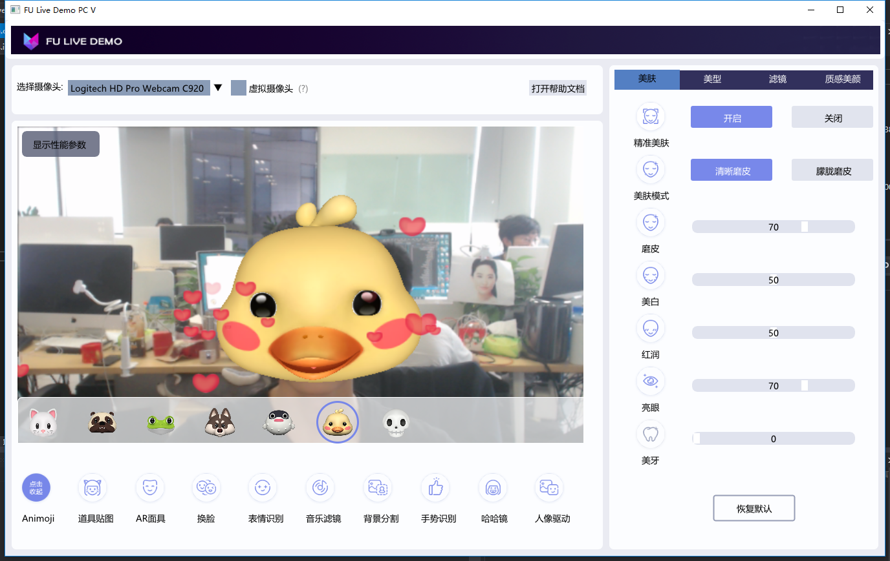

# Demo运行说明文档-Windows 
更新日期：2019-08-14
级        别：Public 

------
### 最新更新内容：

2019-08-14 v6.3.0：

- 优化人脸美妆功能，提高性能，降低功耗。
- 新增fuSetFaceTrackParam接口，用于设置人脸表情跟踪参数。 
- 新增人脸美颜精细磨皮效果。

文档：

   - [美颜道具功能文档](美颜道具功能文档.md)

- [美妆道具功能文档](美妆道具功能文档.md)

- [海报换脸功能文档](海报换脸功能文档.md) *

- [表情动图功能文档](表情动图功能文档.md) *

  *注：海报换脸功能，表情动图功能暂时没有在windows版的demo中体现，如需体验可下载本公司Android或IOS的demo进行体验。

工程案例更新：

- 美颜道具部分接口已改变，请注意同步代码！
- anim_model.bundle以及ardata_ex.bundle已弃用，请删除相关数据及代码

------
### 目录：
本文档内容目录：

[TOC]

------
### 1. 简介 
本文档旨在说明如何将Faceunity Nama SDK的Windows Demo运行起来，体验Faceunity Nama SDK的功能。FULivePC 是 Faceunity 的面部跟踪和虚拟道具功能在PC中的集成，作为一款集成示例。  

------
### 2. Demo文件结构
本小节，描述Demo文件结构，各个目录，以及重要文件的功能。

```
+FULivePC
  +assets 			  	//资源目录
  +FULivePC				//示例代码目录
    +GUI				//GUI文件目录
    +ipc				//ipc文件目录
    +rapidjson			 //json库文件目录
    +Sound				 //声音库文件目录
    -Camera.cpp：相机类，负责从摄像头内读取图像帧
    -Camera.h：相机类的头文件
    -Config.h：配置文件，记录道具文件的加载路径
    -FULivePC.cpp：程序入口
	-FULivePC.vcxproj：visual studio工程配置文件
	-FULivePC.vcxproj.filters：visual studio工程目录文件
	-FULivePC.vcxproj.user：visual studio用户配置文件
	-imgui.ini：GUI的初始化配置文件
	-Nama.cpp：负责展示如何调用Nama SDK的接口
	-Nama.h：展示如何调用Nama SDK的接口类的头文件
	-UIBridge.h：负责展示虚拟摄像头的接入与使用
	-ReadMe.txt：简单的接入说明
  +docs					//文档目录
  +ThridParty			//第三方库目录
  +include				//SDK包含目录
  +Win32   				//32位SDK目录
  +Win64   				//64位SDK目录
  -readme.md			//工程总文档
```

------
### 3. 运行Demo 

#### 3.1 开发环境
##### 3.1.1 支持平台
```
Windows7及以上
```
##### 3.1.2 开发环境
```
vs2015
```

#### 3.2 准备工作 
- [下载demo代码](<https://github.com/Faceunity/FULivePC> )
- 获取证书:
  1. 拨打电话 **0571-88069272** 
  2. 发送邮件至 **marketing@faceunity.com** 进行咨询。
#### 3.3 相关配置

- 将证书文件authpack.h放置到include文件夹内（authpack.h由3.2步骤申请到）。

#### 3.4 编译运行

- 双击FULivePC.sln打开工程后，按F5编译运行程序。

  

------
### 4. 常见问题 
- visual studio版本不为2015版本时，会在编译时提示错误。
- **因Github不支持上传100MB以上的文件，FULivePC\ThridParty\opencv400\opencv\build\x64\vc14\bin\opencv_world400d.rar是经过压缩的dll，使用时请自行解压！**
